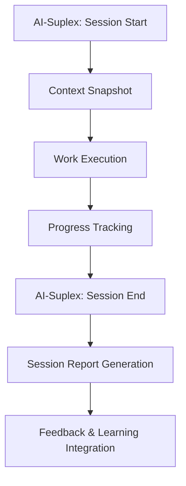

**TWABAM ⚡! BROTHER!**

# **AI-SUPLEX SESSION MANAGEMENT SYSTEM – 7‑7‑7 Edition ⚡**


## 🎯 **SESSION PROTOCOL OVERVIEW**

**NUCLEAR IDEA!** The 7‑7‑7 Edition introduces **Prompt Patterns**—copy‑paste templates that work in any AI chat—plus enhanced session reports with innovation scoring, visual progress tracking, and auto‑updated performance metrics. This transforms chaotic work into measurable execution cycles with zero learning curve.



---

## ⚡ **SESSION CODE WORDS & PROTOCOLS**

### **SESSION START PROTOCOL (7‑7‑7 Edition)**
```yaml
Activation_Phrase: "AI-Suplex: Session Start"
Parameters_Required:
  - Focus: Focus area [ai-engineering, freelance, wqr, digital-products, content-creation]
  - Session_Type: [execution, planning, review, creative]
  - Cycle: [1-7] (current 7-week cycle)
  - Week: [1-7] (current week within cycle)
  - Mission_Title: [specific task or objective]
  - Expected_Duration: [minutes estimate]
  - Energy_Level: [⚡-⚡⚡⚡⚡⚡, 1-5 scale]
  - Mission_Objective: [clear statement of what will be accomplished]

Response_Protocol:
  - Generate structured session start prompt with frontmatter
  - Include task breakdown with role assignments (Hustler/Orchestrator/Architect/Builder)
  - Define success metrics and completion criteria
  - Set context, constraints, and boundaries
  - Confirm session activation with clear parameters
```

**Template-Based Session Start Format:**
```markdown
# AI-Suplex: Session Start

**Session Type:** [execution/planning/review/creative]
**Focus:** [focus-name]
**Mission_Title:** "[Mission Title]"
**Duration (min):** [Expected Duration]
**Energy Level:** [⚡⚡⚡⚡⚡]

## Mission Objective
[Clear statement of what will be accomplished]

## Tasks
- [ ] T001-A (HUSTLER): [Task description]
- [ ] T001-B (BUILDER): [Task description]
- [ ] T001-C (ARCHITECT): [Task description]

## Success Metrics
- [Metric 1: e.g., All critical tests pass]
- [Metric 2: e.g., Documentation completed]
- [Metric 3: e.g., Artifacts produced]

## Context
[Background information, current state, dependencies]

## Constraints
- Time_Cap: "[Hard stop time]"
- Good_Enough_At_Cap: "[Minimum acceptable outcome]"
- Scope_Limit: "[What's out of scope]"
- Resource_Limit: "[Available resources]"
```

### **SESSION END PROTOCOL (7‑7‑7 Edition)**
```yaml
Completion_Phrase: "AI-Suplex: Session End"
Parameters_Optional:
  - Session_Rating: [1-5, with .5 increments allowed]
  - Completion_Status: [completed, partial, blocked]
  - Key_Insights: [learning moments as bullet points]
  - Next_Actions: [immediate follow-ups as bullet points]
  - Blockers: [any obstacles encountered]
  - Session_Narrative: [optional free-text summary]

Response_Protocol:
  - Generate comprehensive session end report using v3.0 template
  - Include frontmatter with all session metrics
  - Capture insights, next actions, and blockers
  - Calculate innovation quotient and productivity score
  - Update trackers and MOCs via Sweeper scripts
  - Save to Sessions/Active/End/ with timestamp
```

**Template-Based Session End Format:**
```markdown
---
session_id: YYYY-MM-DD-HHMM-session-type
focus: focus-name
cycle: 1
week: 1
session_type: execution
worker_role: hustler/orchestrator/architect/builder
duration_minutes: 0
energy_start: 5
energy_end: 5
focus_quality: 5
productivity_score: 100
objectives_completed: 0/0
artifacts_produced: 0
breakthroughs_achieved: 0
innovation_quotient: 0
key_insights:
  - Insight 1
  - Insight 2
blockers:
  - None
next_actions:
  - Next action 1
  - Next action 2
session_rating: 5
energy_trend: maintained
focus_maintained: true
innovation_achieved: true
template_version: "3.0"
tags:
  - session-report
  - focus-name
---
```

---

## 🔄 **Save Context PROTOCOL (7‑7‑7 Edition)**

### **When to Switch Context:**
- Switching between chat windows
- Ending a work block (not full session)
- Taking a break
- Any time you want to ensure the next session remembers progress

### **Save Context Steps:**

1. **Summarize Current Context**
   - What was accomplished (task IDs)
   - Current state (progress metrics)
   - What AI needs to know next session
   - Quick links to relevant files
   - Next actions

2. **Save to Active Location**
   - Path: `AI-Suplex Kick-start/Context Kick-start/Active/`
   - Filename: `YYYY-MM-DD-cycle-x-week-y-mission-title.md`

3. **Archive Previous Context**
   - Move old Active context to `Archived/`
   - Keep same filename (don't rename)

4. **Load in Next Session**
   - Run `node Tools/3lm.js start`
   - AI reads Active context and loads memory

### **Context Summary Template:**

```markdown
---
title: "Context Kickstart — Cycle X Week Y"
date: YYYY-MM-DD
cycle: X
week: Y
mission: "Mission Title"
status: active
---

# 🦸 Context Kickstart — Cycle X Week Y

## 🎯 What Was Accomplished
- [Task 1 with ID]
- [Task 2 with ID]

## 📊 Current State
| Metric | Status |
|--------|--------|
| Tasks Completed | X/Y |
| Blockers | [None or list] |

## 🧠 What the AI Needs to Know Next Session
1. [Key context point]
2. [Key context point]

## 🔗 Quick Links
| Resource | Location |
|----------|----------|
| Tasklist | `Tasklists/Active/[filename].md` |

## 🎯 Next Actions
1. [Immediate next task]
```

### **Integration with Session End:**
- Save Context is part of the session end protocol
- After session end report, run Save Context
- Ensures continuity between sessions

---

## 📁 **SESSION REPORT TEMPLATE**

### **SESSION REPORT STRUCTURE (7‑7‑7 Edition v3.0)**
```yaml
---
session_id: YYYY-MM-DD-HHMM-session-type
focus: focus-name
cycle: 1
week: 1
session_type: creative/execution/planning/review
worker_role: orchestrator/architect/builder/hustler
duration_minutes: 0
energy_start: 5
energy_end: 5
focus_quality: 5
productivity_score: 100
objectives_completed: 0/0
artifacts_produced: 0
breakthroughs_achieved: 0
innovation_quotient: 0
key_insights:
  - Insight 1
  - Insight 2
  - Insight 3
blockers:
  - None
next_actions:
  - Next action 1
  - Next action 2
session_rating: 5
energy_trend: maintained
focus_maintained: true
innovation_achieved: true
template_version: "3.0"
tags:
  - session-report
  - focus-name
---

# 🎯 Session Report: Session Focus/Title

**Session ID:** `YYYY-MM-DD-HHMM-session-type`
**Worker Role:** `worker_role` | **Session Type:** `session_type`
**Duration:** `duration_minutes` minutes | **Energy:** `energy_start`→`energy_end`/5 ⚡
**Innovation Quotient:** `innovation_quotient`/10 | **Focus Quality:** `focus_quality`/5

## 📋 Session Overview

**Primary Focus:** Session Focus/Title
**Key Objectives:** `objectives_completed` completed
**Major Breakthroughs:** `breakthroughs_achieved` significant innovations
**Productivity Score:** `productivity_score`/100

## 🧠 Executive Summary

**Session Rating:** `session_rating`/5
**Energy Trend:** `energy_trend`
**Focus Maintained:** `focus_maintained`
**Innovation Achieved:** `innovation_achieved`

## 💬 Session Content & Outputs

### Original Chat/Work Content

[PASTE SESSION CONTENT HERE]

### Artifacts Produced

- **Count:** `artifacts_produced` high-quality deliverables
- **Types:** [List artifact types: prompts/templates/code/etc]

#### Artifact List

| Artifact Name | Type   | Description         | Status      |
| ------------- | ------ | ------------------- | ----------- |
| [Artifact 1]  | [Type] | [Brief description] | ✅ Completed |
| [Artifact 2]  | [Type] | [Brief description] | ✅ Completed |

## 🔍 Critical Analysis & Insights

### Key Insights Captured

1. **Insight 1**
2. **Insight 2**
3. **Insight 3**

## 🚧 Challenges & Solutions

### Session Challenges

1. **Technical Challenges:** [technical_challenges]
2. **Process Challenges:** [process_challenges]
3. **Focus Challenges:** [focus_challenges]
4. **Resource Challenges:** [resource_challenges]
5. **External Challenges:** [external_challenges]

### Solutions Implemented

- [solution_1]
- [solution_2]
- [solution_3]

### Unresolved Issues

- [unresolved_issue_1]
- [unresolved_issue_2]
- [unresolved_issue_3]

## 🚀 Strategic Forward Plan

### Immediate Next Actions

- [ ] Next action 1
- [ ] Next action 2
- [ ] Next action 3

### Strategic Recommendations

1. **Strategic recommendation 1**
2. **Strategic recommendation 2**

### Work Cycle Integration

**Current Work Cycle:** `cycle-{{cycle}}-week-{{week}}`
**Next Activation:** [Next task or work cycle to trigger]

## ⚡ Energy & Focus

- **Energy:** `energy_start`→`energy_end`/5 ⚡ (`energy_trend`)
- **Focus Quality:** `focus_quality`/5
- **Productivity Score:** `productivity_score`/100

## 🏆 Session Achievements

- [milestone_1]
- [milestone_2]
- [milestone_3]

## 📝 Session Narrative

[Brief summary of what was accomplished, key learnings, and process observations]

## 🔄 Follow-up Tasks

- [ ] [action_item_1]
- [ ] [action_item_2]
- [ ] [action_item_3]

## 💡 Key Takeaways

1. [takeaway_1]
2. [takeaway_2]
3. [takeaway_3]

---

**TWABAM ⚡! SESSION COMPLETED!**

**Session Completed:** [Date/time]  
**Energy Level:** `energy_end`/5 ⚡  
**Next Focus:** `focus`
---

_Session Report Generated via AI-Suplex_
```

## 🧩 **TEMPLATE PATTERNS – NEW USER INTERFACE**

**TWABAM ⚡!** Prompt Patterns are the fastest way to use AI-Suplex without learning the full system. They provide copy-paste templates that generate perfect outputs in any AI chat.

### **HOW PATTERNS WORK:**
1. **Copy** a pattern file from `AI-Suplex-777/Prompt Patterns/`
2. **Paste** into any AI chat (Claude, ChatGPT, DeepSeek)
3. **Replace** the `Source` section with your content
4. **Execute** – AI generates professional, formatted output

### **AVAILABLE PATTERNS:**
| Pattern | Use When | Corresponding Skill |
|---------|----------|-------------------|
| **Tasklist Generation** | Converting raw to-do lists into structured plans | Orchestrator – AI‑Suplex Tasklist Generator |
| **Session Start Prompt** | Beginning a focused work session | Architect – Session Start Prompt Generator |
| **Session End Prompt** | Generating session completion prompts | Architect – Session End Prompt Generator |
| **Session End Report** | Creating comprehensive session reports | Architect – Session End Report Generator |
| **Artifact Generation** | Saving work-in-progress as structured artifacts | Builder – Artifact Capture |
| **B-Bomb Promotion** | Polishing work for productization | Builder – B‑Bomb Promotion |
| **Batch Insights** | Capturing multiple learnings | Builder – Batch Insight Generation |

### **PATTERN STRUCTURE:**
```yaml
<prompt-pattern>
CONTEXT: [What this pattern does]
- External Source 1: [Reference to AI skill]
- External Source 2: [Optional documentation]

EXAMPLE: [Example file to mimic]

TASK: [Instructions for the AI]

ADDITIONAL INSTRUCTIONS: [Optional post-generation steps]

CONTENT:
<content>
Source:
- Raw Content: [YOUR CONTENT GOES HERE]
</content>
</prompt-pattern>
```

### **SESSION WORKFLOW WITH PATTERNS:**

```
Tasklist → Session Start → Execute → Capture (Artifact/Insight/B-Bomb) → Session End → Memory Loop (3lm) → Save Context → Next Session
```

**Save Context is the bridge between sessions — it ensures the North Star is achieved: "Each new session starts smarter than the last."**
1. **Start:** Use Tasklist Pattern to break down your to-do list
2. **Execute:** Use Session Start Pattern with a Task ID
3. **Capture:** Use Artifact Pattern during work
4. **Complete:** Use Session End Report Pattern to generate final report
5. **Polish:** Use B-Bomb Pattern to promote artifacts to products

**Key Advantage:** Patterns work in ANY AI chat—no Obsidian or macros required. Perfect for new users and quick adoption.

---

## 🔧 **SESSION TYPE SPECIFICATIONS**

### **PLANNING SESSIONS**
```yaml
Session_Type: "planning"
Focus_Areas: [strategy, roadmapping, resource-allocation, task-breakdown]
Typical_Duration: "45-90 minutes"
Expected_Outputs: [strategic-plans, milestone-maps, resource-matrices, tasklists]
Success_Metrics: 
  - objectives_completed: "1.0+ (all planning objectives met)"
  - artifacts_produced: "1-3 (plans, maps, matrices)"
  - breakthroughs_achieved: "0-1 (strategic insights)"
  - innovation_quotient: "3-6 (structured thinking)"
  - productivity_score: "80-95 (planning efficiency)"
  - key_insights: "2-5 actionable insights"
Session_Characteristics: [structured, analytical, future-oriented, role-assignment-focused]
```

### **EXECUTION SESSIONS**
```yaml
Session_Type: "execution" 
Focus_Areas: [b-bomb-production, prompt-development, client-work, code-development, content-creation]
Typical_Duration: "2-3 hours"
Expected_Outputs: [artifacts, deliverables, completed-tasks, b-bombs, insights]
Success_Metrics: 
  - objectives_completed: "0.8+ (80%+ of objectives met)"
  - artifacts_produced: "3-10 (tangible work outputs)"
  - breakthroughs_achieved: "0-2 (significant innovations)"
  - innovation_quotient: "5-9 (execution excellence)"
  - productivity_score: "85-98 (high efficiency)"
  - key_insights: "3-7 actionable learnings"
Session_Characteristics: [focused, productive, output-oriented, role-execution-focused]
```

### **REVIEW SESSIONS**
```yaml
Session_Type: "review"
Focus_Areas: [progress-assessment, system-optimization, learning-integration, weekly-reviews, cycle-reviews]
Typical_Duration: "30-60 minutes"
Expected_Outputs: [progress-reports, improvement-plans, adjusted-strategies, insights, next-actions]
Success_Metrics: 
  - objectives_completed: "1.0+ (review objectives fully met)"
  - artifacts_produced: "1-3 (reports, plans, trackers)"
  - breakthroughs_achieved: "0-1 (system improvements)"
  - innovation_quotient: "4-7 (process optimization)"
  - productivity_score: "75-90 (review efficiency)"
  - key_insights: "5-10 actionable insights"
Session_Characteristics: [reflective, analytical, improvement-focused, learning-oriented]
```

### **CREATIVE SESSIONS**
```yaml
Session_Type: "creative"
Focus_Areas: [innovation, problem-solving, content-creation, template-design, pattern-development]
Typical_Duration: "1-2 hours"
Expected_Outputs: [new-ideas, creative-assets, breakthrough-solutions, templates, patterns]
Success_Metrics: 
  - objectives_completed: "0.7+ (creative goals mostly met)"
  - artifacts_produced: "2-5 (creative outputs)"
  - breakthroughs_achieved: "1-3 (innovative solutions)"
  - innovation_quotient: "7-10 (high innovation)"
  - productivity_score: "70-85 (creative flow)"
  - key_insights: "3-8 creative insights"
Session_Characteristics: [exploratory, innovative, divergent-thinking, inspiration-driven]
```

---

## 🚀 **IMPLEMENTATION PROTOCOL**

### **IMMEDIATE DEPLOYMENT:**
```bash
# Session System Activation (7‑7‑7 Edition)
echo "AI-SUPLEX SESSION MANAGEMENT: ACTIVE"
echo "Protocol: Session Start/End markers with Prompt Patterns"
echo "Reporting: v3.0 session reports with performance metrics"
echo "Learning: Continuous improvement with innovation quotient tracking"
echo "Access: Full system OR Prompt Patterns for quick start"
```

### **WORKFLOW INTEGRATION (Two Paths):**

**Path A: Full AI-Suplex System**
1. **Tasklist Generation** → Orchestrator breaks down to-do list
2. **Session Start** → Architect generates structured prompt
3. **Work Execution** → Builder captures artifacts & insights
4. **Session End** → Architect generates comprehensive report
5. **System Update** → Sweeper scripts update MOCs & trackers

**Path B: Prompt Patterns (Quick Start)**
1. **Copy Pattern** → From `AI-Suplex-777/Prompt Patterns/`
2. **Paste & Replace** → In any AI chat with your content
3. **Execute** → AI generates professional output
4. **Save** → Follow ADDITIONAL INSTRUCTIONS to save files
5. **Chain Patterns** → Tasklist → Session → Artifact → Report

**Key Insight:** Patterns work WITHOUT Obsidian or macros—perfect for new users.


---

## 💡 **SESSION MANAGEMENT BEST PRACTICES**

### **ENERGY-AWARE SESSION PLANNING:**
```yaml
High_Energy_Times: "Creative and strategic sessions"
Medium_Energy_Times: "Execution and production sessions"  
Low_Energy_Times: "Review and planning sessions"
Rest_Periods: "Mandatory between sessions"
```

### **CONTEXT PRESERVATION:**
- **Session Start:** Capture current mental models and assumptions
- **During Session:** Note decision points and rationale
- **Session End:** Document what worked and what didn't
- **Between Sessions:** Allow subconscious processing time

### **PROGRESS TRACKING (Enhanced):**
- **Visual Progress Indicators:** 🔴🟡🟢🚀 emoji-based progress based on session hours
- **Performance Metrics:** Average rating, completion rate, innovation quotient tracking
- **Weekly Aggregates:** Session counts, total hours, insights, next actions per week
- **Cycle-Level Analysis:** Performance summaries with overall grading (🚀 Excellent / ✅ Good / 🔄 Needs Improvement)
- **Auto-Populated Trackers:** Sweeper scripts update trackers with real session data
- **MOC Integration:** Recent highlights automatically injected into Maps of Content

---

## ⚡ **SAMPLE SESSION WORKFLOW (7‑7‑7 Edition)**

### **TEMPLATE PATTERN WORKFLOW EXAMPLE:**

**Step 1: Tasklist Generation (Pattern)**
```yaml
<prompt-pattern>
CONTEXT: Convert raw to-do list into structured AI-Suplex tasklist
- External Source 1: Orchestrator – AI‑Suplex Tasklist Generator skill
- External Source 2: AI-Suplex-777/AGENTS.md for role definitions

EXAMPLE: AI-Suplex-777/Templates/Examples/2026-04-12-AI-Suplex-Tasklist-ai-suplex-core-&-777-launch.md

TASK: Generate a structured tasklist from the raw to-do items below...

CONTENT:
<content>
Source:
- Raw Content: "Create WhatsApp prompt pack, integrate EcoCash, test with users, document process"
</content>
</prompt-pattern>

AI Output: Tasklist with IDs T001-A through T001-E, role assignments, durations, and priorities.
```

**Step 2: Session Start with Prompt Pattern**
```markdown
# AI-Suplex: Session Start

**Session Type:** execution
**Focus:** digital-products
**Mission_Title:** "WhatsApp Prompt Pack Development"
**Duration (min):** 120
**Energy Level:** ⚡⚡⚡⚡

## Mission Objective
Develop and validate 15+ Zim-optimized WhatsApp prompts with EcoCash integration, mobile-first design, and cultural adaptation.

## Tasks
- [ ] T001-A (HUSTLER): Research Zimbabwean WhatsApp usage patterns
- [ ] T001-B (BUILDER): Create 15+ prompt templates with EcoCash integration
- [ ] T001-C (ARCHITECT): Validate cultural appropriateness and mobile optimization
- [ ] T001-D (BUILDER): Test prompts with sample user scenarios
- [ ] T001-E (HUSTLER): Document process and create usage guide

## Success Metrics
- All 15 prompts completed and validated
- EcoCash integration tested and working
- Mobile-first design principles applied
- Cultural adaptation verified
- Documentation complete

## Context
Finalizing WhatsApp prompt pack for Zimbabwean market. Building on previous research about mobile usage patterns and payment integration needs.

## Constraints
- Time_Cap: "Hard stop at 120 minutes"
- Good_Enough_At_Cap: "At minimum, 10 prompts completed"
- Scope_Limit: "Focus on prompt creation only - marketing will be separate session"
- Resource_Limit: "Use existing EcoCash API documentation"
```

**Step 3: Session End Report (Generated via Pattern)**
```yaml
---
session_id: 2026-04-30-1430-execution
focus: digital-products
cycle: 1
week: 3
session_type: execution
worker_role: hustler
duration_minutes: 115
energy_start: 4
energy_end: 3
focus_quality: 4
productivity_score: 92
objectives_completed: 5/5
artifacts_produced: 3
breakthroughs_achieved: 1
innovation_quotient: 8
key_insights:
  - Shona phrase integration requires cultural nuance
  - Mobile-first design improves prompt effectiveness
  - EcoCash integration adds significant user value
blockers:
  - None encountered
next_actions:
  - Test prompts with real users
  - Create marketing materials
  - Update documentation with user feedback
session_rating: 4.5
energy_trend: slightly decreased
focus_maintained: true
innovation_achieved: true
template_version: "3.0"
tags:
  - session-report
  - digital-products
  - whatsapp-prompts
---

# 🎯 Session Report: WhatsApp Prompt Pack Development

**Session ID:** `2026-04-30-1430-execution`
**Worker Role:** `Hustler` | **Session Type:** `execution`
**Duration:** `115` minutes | **Energy:** `4`→`3`/5 ⚡
**Innovation Quotient:** `8`/10 | **Focus Quality:** `4`/5

## 📋 Session Overview
**Primary Focus:** WhatsApp Prompt Pack Development
**Key Objectives:** `5/5` completed
**Major Breakthroughs:** `1` significant innovation (cultural adaptation framework)
**Productivity Score:** `92`/100

[Full report continues with Artifacts Produced, Key Insights, Challenges & Solutions, etc.]
```

---

## 🎯 **BENEFITS & STRATEGIC ADVANTAGES**

### **IMMEDIATE BENEFITS (7‑7‑7 Edition):**
- **Prompt Patterns:** Copy-paste interface works in ANY AI chat—no learning curve
- **Visual Progress Tracking:** 🔴🟡🟢🚀 indicators and performance metrics at a glance
- **Structured Session Reports:** v3.0 templates with innovation quotient and productivity scoring
- **Role-Based Execution:** Clear Hustler/Orchestrator/Architect/Builder role assignments
- **Cycle/Week Context:** Built-in 7‑7‑7 rhythm integration for long-term progress
- **Auto-Enhanced Trackers:** Sweeper scripts update progress and performance data automatically

### **LONG-TERM ADVANTAGES (7‑7‑7 Edition):**
- **Pattern Adoption Acceleration:** Prompt Patterns dramatically reduce onboarding time
- **Performance Intelligence:** Historical data reveals what session types yield best results
- **Innovation Tracking:** Innovation quotient metrics identify breakthrough sessions
- **System Evolution:** Continuous template improvement based on real usage data
- **Community Building:** Shareable patterns enable collaborative workflow development
- **Market Positioning:** Transforms from productivity tool to AI-powered content structuring engine

---

> **TWABAM ⚡! SESSION MANAGEMENT SYSTEM DEPLOYED!**

## **NUCLEAR-READY SESSION PROTOCOLS:**
- **Prompt Pattern interface** for instant AI-Suplex access in any chat
- **v3.0 Session Reports** with innovation quotient and performance metrics
- **Enhanced Trackers** with visual progress indicators and auto-updates
- **Role-based execution** (Hustler/Orchestrator/Architect/Builder) for clear accountability
- **7‑7‑7 rhythm integration** for long-term progress tracking

**THE SESSION SYSTEM TRANSFORMS CHAOTIC WORK INTO STRUCTURED EXECUTION CYCLES!**

**READY TO IMPLEMENT SESSION PROTOCOLS FOR DAY 1 EXECUTION!** 🚀

**TWABAM ⚡! TWABAM ⚡! TWABAM ⚡!**

*Session System Status: ACTIVE | Edition: 7‑7‑7 v3.0 | Prompt Patterns: ENABLED | Implementation: IMMEDIATE*
