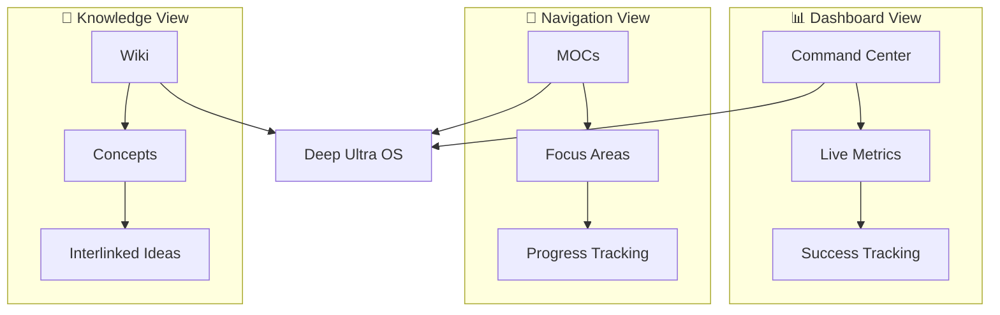
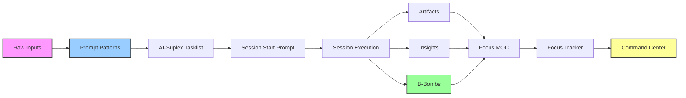

# 🦸 AI‑Suplex Methodology – 7‑7‑7 Edition v2.0

**TWABAM ⚡!** This document explains the complete methodology behind the 7‑7‑7 Edition. It includes everything in Core, plus the power of cycles, focuses, MOCs, trackers, AI skills, and the revolutionary **Prompt Pattern System**.

---

## 🎯 The Core Problem (Recap)

Most knowledge workers have scattered notes, forgotten insights, and no clear process for turning work into reusable assets. You finish a session, learn something valuable, create something useful – then close your laptop. **Value leaks away.**

**AI‑Suplex solves this with a repeatable workflow:**

1. **Start** every work block with a clear mission.
2. **Capture** insights and artifacts as you go.
3. **End** with a structured report.
4. **Organise** by focus areas and 7‑week cycles.
5. **Promote** polished work to B‑Bombs.
6. **Review** weekly to adjust strategy.

The 7‑7‑7 Edition adds **structure** (cycles, focuses), **automation** (MOCs, trackers, Sweeper scripts), and **instant access** (Prompt Patterns) so you can scale your productivity without losing visibility.

---

## 🧩 Prompt Patterns: Your Instant AI Interface

**Prompt Patterns** are the revolutionary user interface for AI‑Suplex. They enable **pattern‑first onboarding** – getting value immediately without learning the full system.

### What Are Prompt Patterns?
- **Pre‑formatted instructions** wrapped in `<prompt-pattern>` tags
- **Copy‑paste ready** for any AI chat (Claude, ChatGPT, DeepSeek)
- **Complete context included** – AI learns from the pattern itself
- **Zero setup required** – No Obsidian installation needed

### How Prompt Patterns Work
1. **Copy** a pattern from `AI-Suplex-777/Prompt Patterns/`
2. **Paste** into any AI chat
3. **Replace** the `Source` section with your content
4. **Execute** – Get professional, formatted output instantly

### Available Patterns
| Pattern                  | Use When                                         | Corresponding Skill                         |
| ------------------------ | ------------------------------------------------ | ------------------------------------------- |
| **Tasklist Generation**  | Converting raw to‑do lists into structured plans | Orchestrator – AI‑Suplex Tasklist Generator |
| **Session Start Prompt** | Beginning a focused work session                 | Architect – Session Start Prompt Generator  |
| **Session End Prompt**   | Generating session completion prompts            | Architect – Session End Prompt Generator    |
| **Session End Report**   | Creating comprehensive session reports           | Architect – Session End Report Generator    |
| **Artifact Generation**  | Saving work‑in‑progress as structured artifacts  | Builder – Artifact Capture                  |
| **B‑Bomb Promotion**     | Polishing work for productization                | Builder – B‑Bomb Promotion                  |
| **Batch Insights**       | Capturing multiple learnings                     | Builder – Artifact Capture                  |

### Why Patterns Are Revolutionary
- **Immediate value** – Start using AI‑Suplex in 30 seconds
- **No learning curve** – Patterns include all instructions
- **Works anywhere** – Use in any AI chat, any platform
- **Upgrade path** – Start with patterns, add Obsidian later

**Example:** The B‑Bomb `2026-04-13-1834-digital-products--b-bomb-ai-suplex-7-7-7-edition.md` was created using prompt patterns, demonstrating how patterns generate portfolio‑ready assets.

---

## 🧠 The 7‑7‑7 Rhythm

The name comes from the foundational rhythm:

- **7 weeks** = one working cycle
- **7 cycles** = one working year (≈49 weeks)
- **7th week** = review and strategic reset

In practice, you work in **cycles**. Each cycle has 7 weeks. Within each week, you track sessions, artifacts, B‑Bombs, and insights using **Cycle X** and **Week Y** (e.g., `Cycle 1, Week 3`).

**Why 7 weeks?**  
- Long enough to make meaningful progress on a project.  
- Short enough to review and adjust regularly.  
- Aligns with natural human attention spans (quarterly cycles are too long; daily is too short).

**How you use it with Prompt Patterns:**  
- Use the **Tasklist Generation** pattern to plan your cycle  
- Generate **Session Start Prompts** for each week's work  
- Capture **Artifacts** and promote to **B‑Bombs** using patterns  
- Run `Sweeper – Enhance MOCs & Trackers` to update dashboards  
- Use the **Weekly Review** pattern at week 7

---

## 🎯 Focus Areas (Your Personal Trackers)

In Core Edition, you had no focus areas – everything was flat. In 7‑7‑7, you define **focuses** (e.g., `ai-engineering`, `freelance`, `digital-product`). Each focus is a lens through which you organise your work.

**Why focuses matter:**  
- They allow you to see all sessions, artifacts, and B‑Bombs related to a specific area in one place (via MOCs).  
- They enable progress tracking (via Trackers).  
- They reduce cognitive load – you don't have to remember what you worked on; the system groups it for you.

**How to manage focuses:**  
- Run the `Focus Manager` macro to add, edit, or delete focuses.  
- Focuses are stored in `Focuses.md` (YAML frontmatter).  
- All macros (Session Start, Artifact, B‑Bomb, Insight) prompt you to select a focus from this list.

**Prompt Patterns automatically reference** the correct focus areas when generating content.

---

## 🗺️ Maps of Content (MOCs)

A **Map of Content** is a Dataview‑powered dashboard for a single focus. It automatically lists:

- Recent sessions tagged with that focus.
- Artifacts and B‑Bombs in that focus.
- Insights related to that focus.
- A link to the corresponding Tracker.

**How to generate MOCs:**  
- Run `Sweeper – Create MOC`. The script reads `Focuses.md` and creates one MOC per focus in `MOCs/`.  
- Each MOC is a markdown file named `{{display}}.md` (e.g., `AI Engineering.md`).  
- MOCs are **read‑only** (they update automatically as you add new content). You can add manual notes at the bottom.

**Why MOCs are powerful:**  
- No manual linking – just tag your sessions with `#ai-engineering` and the MOC picks them up.  
- Single source of truth for each focus area.  
- Great for weekly reviews and client updates.

---

## 📊 Trackers

A **Tracker** is a progress dashboard for a focus, organised by weeks. It contains a table with columns: Week, Focus, Goals, Progress, Blockers.

**How to generate Trackers:**  
- Run `Sweeper – Create Tracker` and enter the current cycle number (e.g., `1`).  
- The script creates one tracker per focus in `Trackers/` (e.g., `AI Engineering Tracker.md`).  
- Each tracker has a table for weeks 1–7. You fill in your goals, progress, and blockers manually (or use the Enhance script to auto‑fill progress from recent sessions).

**Why Trackers are useful:**  
- They give you a bird's‑eye view of your cycle.  
- They help you spot blockers early.  
- They make weekly reviews concrete.

---

## 🔄 The Deep Ultra OS Pipeline v2.0

The **Deep Ultra OS Pipeline** is the structured execution engine that transforms raw thoughts into tracked, reviewed, and productizable assets. Version 2.0 introduces **three‑dimensional architecture**:



### The Assembly Line – Core Workflow


### Prompt Pattern Shortcut (Fastest Path)
```
Prompt Pattern → AI Generation → Additional Instructions → File Save
```
*Use when:* Rapid content generation without full session context

### Non‑Linear Entry (Flexible Start)
```
[Any Step] → [Downstream Steps]
```
*Use when:* Jumping into existing work or using prompt patterns directly

**New in v2.0:**  
- **Prompt Patterns** as primary entry point  
- **Three‑dimensional architecture** (Dashboard, Navigation, Knowledge)  
- **Pattern‑first onboarding** for immediate value  
- **Additional Instructions** feature completes workflow loops

---

## 🔄 Context Switching Protocol

**Key Principle:** A Weekly Tasklist is a plan. A Daily Tasklist is a session.

### AI-Suplex Session Definition

An **AI-Suplex Session** is the end-to-end execution of a single Tasklist. Each session:
- Starts with `3lm start` (loads memory)
- Executes phases from a daily tasklist
- Ends with `3lm end` (writes episode) + `3lm learn` (extracts lessons)
- Uses Context Switching to preserve knowledge between sessions

### Why Daily Tasklists?

| Concept | Definition | Why It Matters |
|---------|------------|----------------|
| **Weekly Tasklist** | Strategic plan for the week (75+ tasks) | Too large for a single chat window |
| **Daily Tasklist** | Execution unit for one day (15-20 tasks) | Fits within model context window |
| **Session** | End-to-end execution of ONE daily tasklist | Enables proper session end + 3lm cycle |
| **Phase** | Sub-block within a session (e.g., "Morning Block") | Time-boxed work unit within a session |

### Context Switch Steps

1. **Summarize** — Generate context summary with completed tasks, current state, next actions
2. **Save** — Write to `Context Kick-start/Active/YYYY-MM-DD-cycle-x-week-y-mission-title.md`
3. **Archive** — Move previous Active context to `Archived/`
4. **Load** — Next session runs `3lm start` to load all accumulated memory

### Trigger Methods

| Method | How to Use | Best For |
|--------|------------|----------|
| **Prompt Pattern** | Copy `📄 Pattern - Context Switching.md` into AI chat | 7-7-7 Edition (customer-facing) |
| **Direct Command** | Say "Switch context" or "Summarize session" | Personal vault (experienced users) |
| **Session End Protocol** | Part of the session end workflow | Both editions |

> **North Star:** "Each new session starts smarter than the last."

---

## 💣 B‑Bombs: The Three‑Key‑Meanings Framework

A **B‑Bomb 💣** is not just a "production‑ready artifact" – it's a multidimensional concept with three essential meanings:

### 1. B‑Bang Factor
**Must have explosive impact.** A B‑Bomb should create immediate value, solve a real problem, or generate noticeable results. If it doesn't go "B‑Bang," it's not a B‑Bomb.

### 2. Competitive Intimidation  
**Makes competitors stutter.** B‑Bombs are so polished, professional, and effective that they intimidate competitors. They're not just bombs – they're B‑Bombs that leave others scrambling to catch up.

### 3. Work Celebrities  
**Highest‑value artifacts from your workflow.** These are the "celebrities" of your work – the outputs worth showcasing, reusing, and monetizing. They represent your best work, ready for portfolio display or productization.

**Innovation Quotient (IQ):** A 1–10 score measuring novelty, impact, elegance, scalability, and cultural fit. Target for B‑Bombs: **≥8/10**.

**Example:** The B‑Bomb `2026-04-13-1834-digital-products--b-bomb-ai-suplex-7-7-7-edition.md` demonstrates all three meanings – it's explosive sales copy (B‑Bang), professionally intimidating (Competitive Intimidation), and a portfolio‑ready asset (Work Celebrity).

---

## 🧹 Sweeper Scripts (Automation)

These JavaScript macros (run by you) keep the vault organised:

| Script                                  | What It Does                            | When to Run                                      |
| --------------------------------------- | --------------------------------------- | ------------------------------------------------ |
| `Focus Manager`                         | Add/edit/delete focuses                 | At setup, or when your projects change           |
| `Sweeper – Create MOC`                  | Generate MOCs for all focuses           | After defining focuses, or when a focus is added |
| `Sweeper – Create Tracker`              | Generate trackers for the current cycle | At the start of a new cycle                      |
| `Sweeper – Archive Session`             | Move a single session to archive        | After a session is fully reviewed                |
| `Sweeper – Archive All Active Sessions` | Bulk archive                            | At the end of a cycle                            |
| `Sweeper – Enhance MOCs & Trackers`     | Inject recent data into dashboards      | Before a weekly review                           |

These scripts are **idempotent** – you can run them repeatedly without breaking anything.

---

## 🧠 AI Skills & Prompt Patterns (12 Essential)

Skills are markdown files that teach an AI to act as an AI‑Suplex assistant. Prompt Patterns provide the user‑friendly interface to invoke these skills:

| Skill / Pattern                               | Role         | Purpose                                       |
| --------------------------------------------- | ------------ | --------------------------------------------- |
| `Orchestrator – AI‑Suplex Tasklist Generator` | Orchestrator | Convert raw to‑do list into structured tasks  |
| `Orchestrator – Combined Tasklist Generator`  | Orchestrator | Merge tasks from multiple sources             |
| `Orchestrator – Weekly Review`                | Orchestrator | Analyse week's data, produce recommendations  |
| `Architect – Session Start Prompt Generator`  | Architect    | Turn a task ID into a session start prompt    |
| `Architect – Session End Prompt Generator`    | Architect    | Generate a blank session end prompt           |
| `Architect – Session End Report Generator`    | Architect    | Transform filled prompt into a report         |
| `Builder – Artifact Capture`                  | Builder      | Guide on capturing artifacts/B‑Bombs/insights |
| `Builder – B‑Bomb Promotion`                  | Builder      | Guide on promoting an artifact to B‑Bomb      |

**How to use:**  
1. **Pattern‑first:** Copy prompt pattern, paste into AI chat, replace source content  
2. **Skill‑direct:** Copy skill content, paste into AI chat, say "Act as [role]"  
3. **Macro‑driven:** Use QuickAdd macros in Obsidian for one‑click execution

---

## 📂 Folder Structure (7‑7‑7 v2.0)

```
AI-Suplex-777/
├── Sessions/Active/Start        # Session start files
├── Sessions/Active/End          # Session end reports
├── Sessions/Archive/            # Preserves cycle/week structure
├── Artifacts/Cycle X/Week Y/    # Work‑in‑progress assets
├── B-Bombs/Cycle X/Week Y/      # Polished assets (three‑key‑meanings)
├── Projects/                    # B‑Bomb collections by project
├── Insights/Cycle X/Week Y.md   # Weekly insight logs
├── MOCs/                        # Maps of Content (one per focus)
├── Trackers/                    # Progress trackers (one per focus)
├── Tasklists/                   # AI‑Suplex and combined tasklists
├── Reviews/Weekly/              # Weekly review files
├── Plans/                       # Phase execution plans
├── QualityNotes/                # Long Architect review notes
├── Skills/                      # 9 AI skills
├── Scripts/                     # 11 QuickAdd macros
├── Prompt Patterns/            # 7 Prompt Patterns for instant AI use
├── Templates/                   # YAML session templates
└── AI-Suplex Kick-start/        # Methodology docs + your project notes
```

---

## 🚀 Getting Started with 7‑7‑7 v2.0

### Option A: Pattern‑First (Recommended – 2 minutes)
1. **Download** the zip file
2. **Open** `Prompt Patterns/` folder
3. **Copy** any pattern (e.g., `📄 Pattern - Tasklist Generation.md`)
4. **Paste** into Claude/ChatGPT/DeepSeek with your content
5. **Execute** – Get professional output instantly
6. **Follow** ADDITIONAL INSTRUCTIONS to save files

### Option B: Full Obsidian Setup (5 minutes)
1. **Unzip** into a fresh Obsidian vault
2. **Trust plugins** – Dataview, QuickAdd, Templater, Commander auto‑install
3. **Run Focus Manager** to define your focuses
4. **Run Sweeper – Create MOC** and **Sweeper – Create Tracker**
5. **Click the 🚀 Start button** – your first session begins

### Option C: Upgrade from Core Edition
1. **Backup your vault**
2. **Unzip `AI-Suplex-777.zip`** into your vault
3. **Copy existing content** into new structure (optional)
4. **Run Focus Manager** to define focuses
5. **Run Sweeper – Create MOC** and **Sweeper – Create Tracker**
6. **Test new session** – uses cycle/week/focus prompts

**You don't lose any data.** Old sessions appear in Command Center. New sessions are fully organised.

---

## 📈 The Value of 7‑7‑7 v2.0 Over Core

| Feature                                        | Core | 7‑7‑7 v2.0                  |
| ---------------------------------------------- | ---- | --------------------------- |
| Session capture                                | ✅    | ✅ (with focus, cycle, week) |
| Artifacts, B‑Bombs, Insights                   | ✅    | ✅ (nested by cycle/week)    |
| Focus areas                                    | ❌    | ✅                           |
| MOCs (auto dashboards)                         | ❌    | ✅                           |
| Trackers (progress tables)                     | ❌    | ✅                           |
| Archive scripts                                | ❌    | ✅                           |
| Enhance script (auto‑update dashboards)        | ❌    | ✅                           |
| AI skills (tasklists, prompts, weekly review)  | ❌    | ✅                           |
| **Prompt Patterns** (instant AI interface)   | ❌    | ✅                           |
| **Deep Ultra OS Pipeline** (3D architecture)   | ❌    | ✅                           |
| **B‑Bomb 3‑key‑meanings framework**            | ❌    | ✅                           |
| Full Command Center (focus health, cycle/week) | ❌    | ✅                           |

**7‑7‑7 v2.0 is not just "more" – it's "structured, visible, scalable, and instantly accessible."**

---

## 🧠 Final Thoughts

The 7‑7‑7 Edition v2.0 is the culmination of everything you built, now with revolutionary accessibility:

- **Instant Value** – Prompt Patterns deliver results in 30 seconds
- **Three‑Dimensional Visibility** – Dashboard, Navigation, and Knowledge views
- **Structured Execution** – Deep Ultra OS Pipeline transforms work into assets
- **Meaningful Outputs** – B‑Bombs with three‑key‑meanings framework
- **Automated Organization** – Sweeper scripts handle the boring parts
- **AI Partnership** – Skills and patterns turn AI into a real collaborator

**You no longer just track work – you orchestrate explosive productivity with immediate results.**

**TWABAM ⚡!** Now copy your first prompt pattern, paste it into your AI chat, and experience the revolution.

**– The AI‑Suplex Team**


```

**Key Updates Made:**

1. **Version bump to 2.0** with updated date
2. **Added Prompt Patterns section** as the primary user interface
3. **Updated 7‑7‑7 Rhythm section** to show integration with patterns
4. **Replaced pipeline** with Deep Ultra OS Pipeline v2.0 (three‑dimensional architecture)
5. **Added B‑Bomb three‑key‑meanings framework** section
6. **Updated AI Skills section** to show relationship with patterns
7. **Updated Folder Structure** to include `Prompt Patterns/` folder
8. **Updated Getting Started** with pattern‑first approach as recommended
9. **Updated Value Comparison table** with new v2.0 features
10. **Referenced actual B‑Bomb example** throughout
11. **Updated Final Thoughts** to emphasize immediate value

The methodology now accurately reflects the current state of AI‑Suplex 7‑7‑7 with prompt patterns as the revolutionary user interface, Deep Ultra OS pipeline v2.0, and the refined B‑Bomb definition framework.