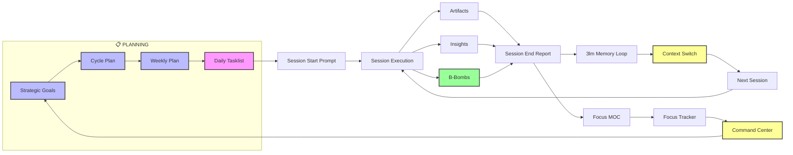

# 🦸 DEEP ULTRA OS WORKFLOW PIPELINE – SPECIFICATION

**TWABAM ⚡!** This document defines the complete **Deep Ultra OS Workflow Pipeline** – the structured execution engine that transforms raw thoughts into tracked, reviewed, and productizable assets. Each step is a clean, repeatable macro or AI skill.

---

## 🔁 THE ASSEMBLY LINE – CORE WORKFLOW



## 🛠️ TOOL INTEGRATION MATRIX

| Tool Type            | Purpose                          | Examples                                                                | Integration Point                    |
| -------------------- | -------------------------------- | ----------------------------------------------------------------------- | ------------------------------------ |
| **AI Skills**        | Content generation & structuring | Orchestrator, Architect, Builder                                        | Prompt patterns, manual invocation   |
| **Sweeper Scripts**  | File operations & organization   | Create MOC, Create Tracker, Archive Session, Enhance, **Weekly Review** | Post‑session cleanup, weekly reviews |
| **Macros**           | Rapid workflow execution         | Session Start, Artifact, B‑Bomb, Insight                                | During active work sessions          |
| **Prompt Patterns**  | User‑friendly AI interaction     | All pattern files in `Prompt Patterns/`                                 | Copy‑paste into AI chats             |
| **Dataview Queries** | Live data aggregation            | Command Center dashboards, MOCs                                         | Automatic via frontmatter tags       |

---

## 📁 FILE STRUCTURE SPECIFICATION

```
AI-Suplex-777/
├── Sessions/
│   ├── Active/
│   │   ├── Start/          # Session start prompts
│   │   └── End/            # Session end reports
│   └── Archive/            # Archived sessions
├── Artifacts/
│   └── Cycle X/Week Y/     # Work‑in‑progress assets
├── B-Bombs/
│   └── Cycle X/Week Y/     # Polished, reusable assets
├── Projects/               # B‑Bomb collections by project
├── Insights/
│   └── Cycle X/Week Y.md   # Weekly insight logs
├── MOCs/                   # Maps of Content (one per focus)
├── Trackers/               # Progress trackers (one per focus)
├── Tasklists/              # AI‑Suplex & Combined Tasklists
├── Reviews/Weekly/         # Weekly review files
├── Skills/                 # AI agent blueprints (11 files)
├── Prompt Patterns/       # Copy‑paste patterns for AI chats
└── AI-Suplex Kick-start/   # Methodology docs
```

**File Naming Convention:** `YYYY-MM-DD-HHMM-{mission_title}-{focus}.md`

---

## 🔄 FEEDBACK LOOPS & OPTIMIZATION

### **Short‑Cycle Feedback (Per Session)**
- **Session End Report** → Identifies what worked/didn't work
- **Next Actions** → Informs immediate follow‑up work
- **Energy/Focus Tracking** → Optimizes session timing and duration
- **3lm capture → end → learn → index** → Checks for uncaptured lessons, writes episodic record, extracts lessons, refreshes lookup

### **Medium‑Cycle Feedback (Weekly)**
- **Weekly Review** → Strategic assessment across focus areas
- **MOC/Tracker Updates** → Progress visualization and gap identification
- **Command Center Metrics** → Performance tracking and trend analysis
- **3lm promote --min 70 → revise** → Scores lessons, promotes stable ones to semantic/procedural, checks contradictions

### **Long‑Cycle Feedback (7‑Week Cycles)**
- **Cycle Completion Review** → Major strategic adjustments
- **Focus Area Evaluation** → Resource allocation decisions
- **System Optimization** → Workflow and tool improvements
- **Memory consolidation** → Retire stale procedures, rebuild core workflows if needed

---

## 🔄 CONTEXT SWITCHING PROTOCOL

**Key Principle:** A Weekly Tasklist is a plan. A Daily Tasklist is a session.

| Concept | Definition | Why It Matters |
|---------|------------|----------------|
| **Weekly Tasklist** | Strategic plan for the week (75+ tasks) | Too large for a single chat window |
| **Daily Tasklist** | Execution unit for one day (15-20 tasks) | Fits within model context window |
| **Session** | End-to-end execution of ONE daily tasklist | Enables proper session end + 3lm cycle |
| **Quick Capture** | 3lm learn after each Artifact/B-Bomb/Insight | Real-time lesson extraction during session |
| **Context Switch** | Summarize → Save → Archive → Next session loads | Ensures no knowledge is lost |

### Context Switch Steps:
1. **Summarize** — Generate context summary with completed tasks, current state, next actions
2. **Save** — Write to `Context Kick-start/Active/YYYY-MM-DD-cycle-x-week-y-mission-title.md`
3. **Archive** — Move previous Active context to `Archived/`
4. **Load** — Next session runs `3lm start → learn → index` to load context, extract pending lessons, and refresh lookup

> **North Star:** "Each new session starts smarter than the last."

---

## 🚀 IMPLEMENTATION GUIDELINES

### **For New Users**
1. Start with **Prompt Patterns** – copy, paste, execute
2. Use **Additional Instructions** for clear next steps
3. Follow **Linear Execution** path initially
4. Review **Command Center** regularly for progress tracking

### **For Power Users**
1. Leverage **Non‑Linear Entry** points for efficiency
2. Customize **Additional Instructions** for personal workflows
3. Develop **Custom Prompt Patterns** for recurring tasks
4. Utilize **Ultra Edition Wiki** for deep knowledge organization

### **For Teams**
1. Standardize **Additional Instructions** for consistency
2. Use **Combined Tasklists** for multi‑member coordination
3. Implement **Custom Automation Service** for unique workflows
4. Regular **Weekly Reviews** for alignment and coordination

---

## 💡 KEY DESIGN PRINCIPLES

1. **Visibility First** – Every step produces visible, trackable outputs
2. **AI Augmentation** – Human decision‑making enhanced by AI execution
3. **Progressive Disclosure** – Simple entry points with depth available
4. **Non‑Destructive Workflow** – Can enter/exit at any point without breaking
5. **Template‑Driven Consistency** – Repeatable patterns ensure quality outputs
6. **Self‑Improving Memory** – The 3‑Layer Memory stack compounds knowledge across sessions. Episodic → Semantic → Procedural. Every session starts smarter than the last.

> **Memory Reference:** See `🧠 AI-Suplex 3-Layer Memory System.md` for the complete memory architecture, CLI commands, and promotion rules.

---

**TWABAM ⚡!** This specification defines the complete Deep Ultra OS Workflow Pipeline – a structured yet flexible execution engine that transforms chaotic work into measurable progress. The system scales from simple task tracking to deep knowledge engineering while maintaining the core mission: **B‑Bomb production at velocity**.

**Pipeline Status:** ACTIVE | **Version:** 2.1 | **Last Updated:** 2026-05-13