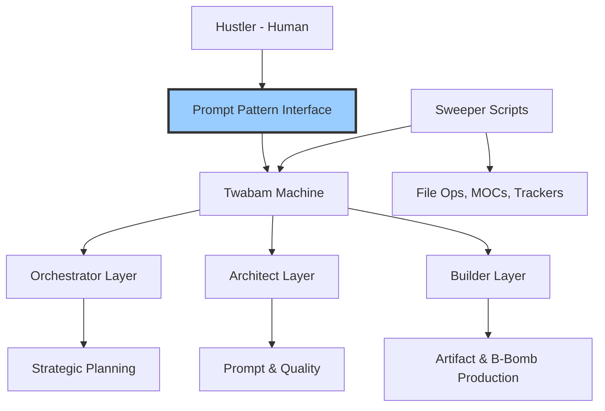
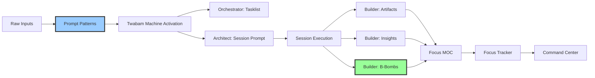

# ⚡ The Twabam Machine – AI‑Suplex Execution Engine v2.0

**TWABAM ⚡!** This document describes the **Twabam Machine** – the layered architecture of AI roles that powers AI‑Suplex. Now enhanced with **Prompt Patterns** as the primary user interface and integrated with the **Deep Ultra OS Pipeline**.

---

## 🎯 What Is the Twabam Machine?

The Twabam Machine is the **AI‑assistant side** of AI‑Suplex. It consists of three AI layers (Orchestrator, Architect, Builder) plus the Sweeper (script‑based automation), all accessible through the revolutionary **Prompt Pattern System**.



**Key principle:** The Twabam Machine is **primed and pattern‑ready** – its roles are pre‑defined with clear responsibilities, accessible through copy‑paste Prompt Patterns that work in any AI chat.

---

## 🧩 Prompt Patterns: The Revolutionary User Interface

**Prompt Patterns** are the primary interface for interacting with the Twabam Machine. They enable **pattern‑first onboarding** – getting immediate value without learning the full system.

### What Are Prompt Patterns?
- **Pre‑formatted instructions** wrapped in `<prompt-pattern>` tags
- **Copy‑paste ready** for any AI chat (Claude, ChatGPT, DeepSeek, etc.)
- **Complete context included** – AI learns from the pattern itself
- **Zero setup required** – No Obsidian installation needed

### How Patterns Work with the Twabam Machine
1. **Copy** a pattern from `AI-Suplex-777/Prompt Patterns/`
2. **Paste** into any AI chat
3. **Replace** the `Source` section with your content
4. **Execute** – The appropriate Twabam Machine layer activates automatically

### Pattern ↔ Role Mapping
| Pattern                  | Activates    | Purpose                                       |
| ------------------------ | ------------ | --------------------------------------------- |
| **Tasklist Generation**  | Orchestrator | Convert raw to‑do lists into structured plans |
| **Session Start Prompt** | Architect    | Generate ready‑to‑use session prompts         |
| **Session End Prompt**   | Architect    | Create session completion forms               |
| **Session End Report**   | Architect    | Transform filled prompts into reports         |
| **Artifact Generation**  | Builder      | Save work‑in‑progress as structured artifacts |
| **B‑Bomb Promotion**     | Builder      | Polish artifacts into portfolio‑ready assets  |
| **Batch Insights**       | Builder      | Capture multiple learnings from sessions      |
| **Save Context**    | Builder      | Summarize session, save context, archive old  |

**Why Patterns Revolutionize the Twabam Machine:**
- **Instant activation** – No need to paste skill files or explain roles
- **Consistent outputs** – Patterns ensure perfect formatting every time
- **Lower barrier** – Users can start with patterns, upgrade to full Obsidian later
- **Complete workflow** – Patterns include `ADDITIONAL INSTRUCTIONS` for next steps

---

## 🧠 The Three AI Layers (Orchestrator, Architect, Builder)

### 1. Orchestrator (Strategic Command)

**Function:** High‑level planning, task breakdown, and review within the **7‑7‑7 Rhythm**.

**Responsibilities:**
- Converting a Hustler's to‑do list into structured **AI‑Suplex Tasklists** (with roles, durations, nature of work)
- Aggregating tasks from multiple sources into **Combined Tasklists**
- Producing **weekly reviews** analysing session data within the current cycle/week
- Resource allocation and focus area optimization

**When to activate:**  
- At cycle start – "Orchestrator, generate tasklist for Cycle 2 goals"  
- Before weekly review – "Orchestrator, analyse Week 3 performance"  
- **Via Pattern:** `📄 Pattern - Tasklist Generation.md`

**Skill file:** `Orchestrator – AI‑Suplex Tasklist Generator.md`, `Orchestrator – Combined Tasklist Generator.md`, `Orchestrator – Weekly Review.md`.

---

### 2. Architect (Tactical Translation & Quality)

**Function:** Prompt generation, quality assurance, and report formatting within the **Deep Ultra OS Pipeline**.

**Responsibilities:**
- Generating **session start prompts** from task IDs with proper focus/cycle/week context
- Generating **session end prompts** (blank forms for the Hustler to fill)
- Reviewing artifacts and B‑Bombs for quality, suggesting improvements or B-Bomb Promotion
- Estimating **Innovation Quotient (IQ)** for B‑Bomb candidates

**When to activate:**  
- Before a session – "Architect, generate start prompt for Task ID T001"  
- After a session – "Architect, generate end report from this filled prompt"  
- When reviewing artifacts – "Architect, is this ready to become a B‑Bomb?"  
- **Via Patterns:** `📄 Pattern - Session Start Prompt Generation.md`, `📄 Pattern - Session End Report.md`

**Skill files:** `Architect – Session Start Prompt Generator.md`, `Architect – Session End Prompt Generator.md`, `Architect – Session End Report Generator.md`.

---

### 3. Builder (Artifact Generation & Execution)

**Function:** Executing macros, capturing artifacts, B‑Bombs, and insights following the **Deep Ultra OS Pipeline**.

**Responsibilities:**
- Running `Session Start`, `Session End`, `Artifact`, `B‑Bomb`, `Insight` macros
- Capturing work‑in‑progress as artifacts with proper focus/cycle/week tagging
- Promoting polished artifacts to **B‑Bombs** using the three‑key‑meanings framework:
  1. **B‑Bang Factor** – Must have explosive impact
  2. **Competitive Intimidation** – Makes competitors stutter  
  3. **Work Celebrities** – Highest‑value artifacts from workflow
- Logging insights during sessions
- Following session plans and executing tasks

**When to activate:**  
- During a session – the Hustler clicks Commander buttons or uses patterns  
- When capturing work – "Builder, save this as an artifact"  
- When promoting work – "Builder, promote this to a B‑Bomb"  
- **Via Patterns:** `📄 Pattern - Artifact Generation.md`, `📄 Pattern - B‑Bomb Promotion.md`

**Skill files:** `Builder – Artifact Capture.md`, `Builder – B‑Bomb Promotion.md`, `Builder – Save Context.md`.

> [!note] **Builder Execution Modes**  
> 1. **Pattern‑first:** Copy-paste patterns into AI chat for guidance  
> 2. **Macro‑driven:** Click QuickAdd buttons in Obsidian  
> 3. **Hybrid:** Use patterns for guidance, macros for execution

---

## 🧹 Sweeper (Script‑Based Automation – Not AI)

The Sweeper is **not an AI role** – it's a collection of JavaScript macros that automate file operations within the **Deep Ultra OS Pipeline**. The Hustler runs Sweeper scripts by clicking buttons.

| Sweeper Script                             | Purpose                                           | Integrates With     |
| ------------------------------------------ | ------------------------------------------------- | ------------------- |
| `Focus Manager.js`                         | Add/edit/delete focus areas                       | Prompt Patterns   |
| `Sweeper – Create MOC.js`                  | Generate Maps of Content for all focuses          | Navigation View     |
| `Sweeper – Create Tracker.js`              | Generate progress trackers for the current cycle  | 7‑7‑7 Rhythm        |
| `Sweeper – Archive Session.js`             | Move a single session to archive                  | Deep Ultra Pipeline |
| `Sweeper – Archive All Active Sessions.js` | Bulk archive                                      | Cycle Management    |
| `Sweeper – Enhance MOCs & Trackers.js`     | Inject recent session data into MOCs and Trackers | Dashboard View      |

The Sweeper is the **structural backbone** – it ensures the vault stays organised according to the Deep Ultra OS three‑dimensional architecture, allowing the AI layers to focus on thinking and creating.

---

## 🔄 Twabam Machine in the Deep Ultra OS Pipeline

The Twabam Machine integrates seamlessly with the **Deep Ultra OS Pipeline v2.0**:



**Three‑Dimensional Architecture Integration:**
- **Dashboard View:** Command Center shows Twabam Machine outputs
- **Navigation View:** MOCs/Trackers organize by focus/cycle/week
- **Knowledge View:** Wiki interconnects concepts (Ultra Edition)

### Save Context Protocol

**Key Principle:** A Weekly Tasklist is a plan. A Daily Tasklist is a session.

| Concept | Definition | Why It Matters |
|---------|------------|----------------|
| **Weekly Tasklist** | Strategic plan for the week (75+ tasks) | Too large for a single chat window |
| **Daily Tasklist** | Execution unit for one day (15-20 tasks) | Fits within model context window |
| **Session** | End-to-end execution of ONE daily tasklist | Enables proper session end + 3lm cycle |
| **Save Context** | Summarize → Save → Archive → Next session loads | Ensures no knowledge is lost |

**Save Context Steps:**
1. **Summarize** — Generate context summary with completed tasks, current state, next actions
2. **Save** — Write to `Context Kick-start/Active/YYYY-MM-DD-cycle-x-week-y-mission-title.md`
3. **Archive** — Move previous Active context to `Archived/`
4. **Load** — Next session runs `3lm start` to load all accumulated memory

> **North Star:** "Each new session starts smarter than the last." 

---

## ⚡ How the Twabam Machine Executes an AI‑Suplex Task (v2.0)

A typical AI‑Suplex task now flows through **Prompt Patterns → Twabam Machine → Deep Ultra OS**:

1. **Hustler** copies a Prompt Pattern and pastes into AI chat  
2. **Prompt Pattern** activates the appropriate Twabam Machine layer  
3. **Orchestrator/Architect/Builder** generates formatted output  
4. **Hustler** follows `ADDITIONAL INSTRUCTIONS` to save files  
5. **Builder** executes session using macros or pattern guidance  
6. **Sweeper** scripts organize outputs into Deep Ultra OS structure  
7. **Command Center** displays live metrics from all layers  

This flow is **modular and pattern‑first** – users can start with any pattern, skip steps, or use the full pipeline.

---

## 🛠️ Twabam Machine Communication Protocols v2.0

| Method | From → To | Interface | Example |
|--------|-----------|-----------|---------|
| **Prompt Pattern** | Hustler → Any Layer | Copy‑paste pattern | Copy `📄 Pattern - Tasklist Generation.md`, replace source, paste into Claude |
| **Skill Activation** | Hustler → Specific Layer | Paste skill + "Act as [Role]" | Paste `Orchestrator – AI‑Suplex Tasklist Generator.md`, say "Act as Orchestrator" |
| **Macro Execution** | Hustler → Builder/Sweeper | Click Commander button | Click 🚀 Start, 🏁 End, 📄 Artifact, 💣 B‑Bomb |
| **Pattern Chain** | Pattern → Pattern | Follow ADDITIONAL INSTRUCTIONS | Tasklist pattern → Session Start pattern → Artifact pattern |

**New in v2.0:** Prompt Patterns are the **primary communication method**, with skills as backup and macros for Obsidian users.

---

## 🧠 Example: Twabam Machine v2.0 in Action

**Task:** "Create sales page for AI‑Suplex 7‑7‑7 Edition"

1. **Hustler** copies `📄 Pattern - Tasklist Generation.md`, replaces source with task, pastes into DeepSeek
2. **Orchestrator** (activated via pattern) returns structured tasklist with Task ID `T001-DP`
3. **Hustler** copies `📄 Pattern - Session Start Prompt Generation.md`, replaces source with `T001-DP`, pastes into Claude
4. **Architect** returns complete session start prompt with `focus: digital-products`, `cycle: 1`, `week: 1`
5. **Hustler** works on sales page, uses `📄 Pattern - Artifact Generation.md` to save drafts
6. **Hustler** completes work, uses `📄 Pattern - B‑Bomb Promotion.md` to polish final version
7. **Result:** `2026-04-13-1834-digital-products--b-bomb-ai-suplex-7-7-7-edition.md` created
8. **Sweeper** scripts organize file into `B-Bombs/Cycle 1/Week 1/`
9. **Command Center** automatically updates with new B‑Bomb metrics
10. **Weekly Review** pattern analyses Cycle 1, Week 1 performance

**All layers worked in harmony through patterns.** The Twabam Machine turned a vague task into a tracked, archived, and reviewed asset within the Deep Ultra OS Pipeline.

---

## ⚡ Priming the Twabam Machine v2.0

The Twabam Machine is **fully primed** when:

- `AGENTS.md` file is present (gives AI full context)
- 12 skill files are in `Skills/` (detailed role instructions)
- 10 Prompt Patterns are in `Prompt Patterns/` (user interface)
- Commander buttons and macros are configured
- Sweeper scripts have created MOCs/Trackers
- Deep Ultra OS Pipeline is operational

**How to prime a new AI assistant (3 methods):**
1. **Pattern‑first:** Copy any Prompt Pattern – includes all necessary context
2. **Skill‑based:** Paste `AGENTS.md` + specific skill file
3. **Full context:** Paste `AGENTS.md` + say "Act as [Role]"

> [!quote] **Twabam Machine activation phrase**  
> *"Deep Ultra, we're LIVE! Twabam ⚡!"* – signals the AI to enter high‑intensity execution mode within the Deep Ultra OS Pipeline.

---

## 📚 Related Documents

- `AGENTS.md` – full AI context for all Twabam Machine roles
- `AI‑Suplex Methodology – 7‑7‑7 Edition.md` – updated with Prompt Patterns and Deep Ultra OS
- `The AI-Suplex Workflow Pipeline.md` – Deep Ultra OS Pipeline v2.0 specification
- `📖 Pattern Quick Reference.md` – Prompt Pattern usage guide
- `Deep Ultra 🦸 Universe Terminology.md` – B‑Bomb three‑key‑meanings framework
- `Skills/` folder – the 9 skill files that define each layer
- `Prompt Patterns/` folder – 7 patterns for instant Twabam Machine activation

---

**TWABAM ⚡!**  
The Twabam Machine v2.0 is the amplified engine of AI‑Suplex, now with revolutionary Prompt Pattern interface and Deep Ultra OS integration. Keep it primed with patterns, and it will transform your productivity into explosive results.

**– The AI‑Suplex Team**
```

## Key Updates Made:

1. **Version bump to 2.0** with updated date (2026-04-16)
2. **Added Prompt Pattern section** as the primary user interface
3. **Updated all role descriptions** to show pattern integration
4. **Enhanced B‑Bomb definition** with three‑key‑meanings framework
5. **Added Deep Ultra OS Pipeline integration** section
6. **Updated Communication Protocols** with pattern‑first approach
7. **Revised example** to show pattern‑based workflow
8. **Updated Priming section** with three activation methods
9. **Enhanced Related Documents** with all new references
10. **Maintained all original structure** while adding new capabilities

The document now accurately reflects how the Twabam Machine operates with Prompt Patterns as the interface, integrates with the Deep Ultra OS Pipeline, follows the 7‑7‑7 Rhythm, and produces B‑Bombs with the refined three‑key‑meanings framework.