---
tags:
  - documentation
  - prompt-pattern
  - workflow
  - ai-agent
date: 2026-04-14
author: Kudakwashe Magwenzi
status: active
version: 1.0
---

# 🧩 Prompt Pattern Usage Specification – AI-Suplex Agentic AI Workflow

## 📋 Overview

The **Prompt Pattern System** is a structured framework that optimizes collaboration between you (the Hustler) and Agentic AI (Claude, ChatGPT, DeepSeek) to execute the complete AI-Suplex pipeline. Instead of guessing how to use templates, this pattern provides **exact instructions** for AI agents to generate consistent, high-quality outputs.

**Why this matters:**  
- **Reduces cognitive load** – You don't need to remember template formats  
- **Ensures consistency** – Every artifact, B-Bomb, and session prompt follows the same structure  
- **Maximizes AI value** – Turns vague requests into precise, executable instructions  
- **Accelerates adoption** – New users can generate professional outputs immediately  

---

## 🔄 The Complete Agentic AI Workflow

```mermaid
graph LR
    A[Hustler: Supply To-Do List] --> B[AI Orchestrator: Generate Tasklist]
    B --> C[Hustler: Save Tasklist + Select Task IDs]
    C --> D[AI Architect: Generate Session Start Prompt]
    D --> E[Hustler: Start AI-Suplex Session]
    E --> F[AI Builder: Capture Artifacts + B-Bombs + Insights]
    F --> G[AI Architect: Generate Session End Prompt]
    G --> H[Hustler: Edit Session End Prompt]
    H --> I[AI Builder: Generate Session End Report]
```



### Step-by-Step Breakdown:

| Step                        | Actor                    | Action                                                                     | Template Used                          |
| --------------------------- | ------------------------ | -------------------------------------------------------------------------- | -------------------------------------- |
| **1. Tasklist Generation**  | **AI Orchestrator**      | Convert raw to-do list into structured tasklist with roles, durations, IDs | `AI-Suplex Tasklist Template`          |
| **2. Session Start Prompt** | **AI Architect**         | Generate session start prompt for specific Task ID                         | `Session Start Prompt Template`        |
| **3. Execution**            | **Hustler + AI Builder** | Run session, capture artifacts/B-Bombs/insights                            | `Artifact Template`, `B-Bomb Template` |
| **4. Session End Prompt**   | **AI Architect**         | Generate session end prompt from completed session                         | `Session End Prompt Template`          |
| **5. Reporting**            | **AI Builder**           | Create formatted session end report                                        | `Session End Report Template`          |

---

## 🎯 Prompt Pattern Format

Use this **exact structure** when instructing AI agents:

```yaml
<prompt-pattern>
CONTEXT: [Detailed description of the task]
- External Source 1: [Reference to AI skill file, e.g., "Orchestrator – AI-Suplex Tasklist Generator"]
- External Source 2: [Reference to documentation, e.g., "AI-Suplex Kick-start/Example Files"]
- Inline Source: [Quick specification – if only inline is specified, use: "Context: Brief Context Description"]

EXAMPLE: [Example file to follow, found in @AI-Suplex-777/Templates/Examples/]
# or use TEMPLATE: [Template file to use, found in @AI-Suplex-777/Templates/]

TASK: [Specific instruction for the AI agent]

ADDITIONAL INSTRUCTIONS: NONE - Specify post-generation tasks e.g: "Save file in patterns folder", "View file in new table", "Append to weekly review"

CONTENT:
<content>

Source: Use one or more source properties that work together:

--- To be replaced with actual source ---

- Raw Content: [Paste your work-in-progress content here - code, diagrams, prompts, research notes, etc.] (required)
- File Reference: [[Existing file with content to convert to artifact]] for context (optional)
- Chat Reference: e.g: Previous Output from session or AI conversation (optional)
  
--- To be replaced with actual source ---

</content> 
</prompt-pattern>
```

> Note 1: Use one or more source properties that work together in clarifying task. As a requirement at least one source must be specified  

> Note 2: Specify either TEMPLATE or EXAMPLE depending on available formatting reference (use TEMPLATE when template file exists, EXAMPLE when following an example file) - EXAMPLE is preferred 

> Note 3: Use ADDITIONAL INSTRUCTIONS field to specify post-generation tasks like file management, quality checks, or workflow integration steps


---

## 📝 Practical Examples

### Example 1: Generating an Artifact

```yaml
<prompt-pattern>
CONTEXT: Capture the webhook configuration I just created for Webhook integration
- External Source 1: Builder – Artifact Capture skill
- External Source 2: AI-Suplex Kick-start/Artifact examples
- Inline Source: Context: Client Project payment webhook setup completed successfully

TEMPLATE: @/AI-Suplex-777/Templates/AI-Suplex - Artifact Template

TASK: Act as Builder. Generate a complete AI-Suplex Artifact using the content provided, following the exact structure and formatting from the Artifact Template. Include proper frontmatter with focus, cycle, week, key insights, and next actions.

ADDITIONAL INSTRUCTIONS: NONE - Specify post-generation tasks e.g: "Save file in Artifacts/Cycle 1/Week 1/ folder"

CONTENT:
<content>

Source:
# Use one or more source properties that work together:
- Raw Content: 
1. Title: "Client Project Webhook Webhook Configuration"
2. Overview: "n8n webhook setup for receiving Webhook payment confirmations"
3. Content: 
{
  "webhook": "https://client-project.co.zw/paynow",
  "method": "POST",
  "headers": {"Content-Type": "application/json"}
}
- File Reference: [[Existing similar artifact for formatting reference]] (optional)

</content>
</prompt-pattern>
```

### Example 2: Generating a Session Start Prompt

```yaml
<prompt-pattern>
CONTEXT: I need to start a session for Task T003-H from my launch tasklist
- External Source 1: Architect – Session Start Prompt Generator
- External Source 2: AI-Suplex Session Start Protocol documentation
- Inline Source: Context: Testing Core vault on fresh Obsidian installation

TEMPLATE: @/AI-Suplex-777/Templates/Session Start Prompt Template

TASK: Act as Architect. Generate a complete AI-Suplex Session Start prompt using the Task ID provided, following the exact structure and formatting from the Session Start Prompt Template. Include all required fields: Session_Type, Focus, Mission, Expected_Duration, Energy_Level, Tasks with role tags, Success Metrics, and optional Context/Constraints.

ADDITIONAL INSTRUCTIONS: NONE - Specify post-generation tasks e.g: "Save file in Sessions/Active/Start/ folder"

CONTENT:
<content>

Source:
--- To be replaced with actual source ---
# Use one or more source properties that work together:
- Raw Content: T003-H: Test Core vault on fresh Obsidian (unzip → open → trust plugins → click Start → Command Center updates)
- File Reference: [[2026-04-12-AI-Suplex-Tasklist-ai-suplex-core-&-777-launch]] for task context (optional)
--- To be replaced with actual source ---

</content>
</prompt-pattern>
```

### Example 3: Generating a Tasklist with Combined Sources

```yaml
<prompt-pattern>
CONTEXT: Generate a structured AI-Suplex tasklist from raw to-do items or project requirements
- External Source 1: Orchestrator – AI‑Suplex Tasklist Generator skill
- External Source 2: AI-Suplex Kick-start/Tasklist examples
- Inline Source: Context: Converting unstructured tasks into battle-ready execution plans

EXAMPLE: AI-Suplex-777/Templates/Examples/2026-04-12-AI-Suplex-Tasklist-ai-suplex-core-&-777-launch

TASK: Act as Orchestrator. Generate a complete AI-Suplex tasklist using the raw input provided, following the exact structure and formatting from the example tasklist. Include proper frontmatter, session breakdowns, role assignments, and execution command.

ADDITIONAL INSTRUCTIONS: NONE - Specify post-generation tasks e.g: "Save file in Tasklists/ folder as YYYY-MM-DD-Project-Tasklist.md"

CONTENT:
<content>

Source:
--- To be replaced with actual source ---
# Use one or more source properties that work together:
- Raw Content: "Launch new client onboarding service: create a welcome packet, set up an automated email sequence, design a client portal, and record a tutorial video."
- File Reference: [[2026-04-12-AI-Suplex-Tasklist-ai-suplex-core-&-777-launch]] for formatting reference (optional)
--- To be replaced with actual source ---

</content>
</prompt-pattern>
```

---

## 🚀 Best Practices & Pro Tips

### 1. **Start Simple, Then Expand**
- **Beginner:** Use just the `TEMPLATE` (or `EXAMPLE`) and `CONTENT` sections
- **Intermediate:** Add `CONTEXT` and one `External Source`
- **Expert:** Use full pattern with all sections for complex tasks

### 2. **Batch Processing for Efficiency**

> *"Capturing insights using Agentic AI: Builder is best suited for batch capture of insights otherwise use macro for single insights"* [^2]

- **Single insight:** Use the `💡 Insight` macro
- **Multiple insights:** Use AI Builder with pattern: "Capture these 5 insights from today's sessions..."

### 3. **Template Reference Shortcuts**
- `@/AI-Suplex-777/Templates/AI-Suplex - Artifact Template`
- `@/AI-Suplex-777/Templates/AI-Suplex - B-Bomb Template`
- `@/AI-Suplex-777/Templates/Session Start Prompt Template`
- `@/AI-Suplex-777/Templates/Session End Prompt Template`

### 4. **AI Role Assignment**
- **Orchestrator:** Tasklists, combined tasklists, weekly reviews [^3]
- **Architect:** Session prompts, quality reviews  [^4]
- **Builder:** Artifacts, B-Bombs, insights ,  reports[^5]

### 5. **Error Prevention**
- **Always** specify the exact template or example path in `TEMPLATE` or `EXAMPLE` field
- **Include** at least one content specification item in the `CONTENT` section
- **Reference** existing files when possible (e.g., `demo.prompt`)
- **Verify** template or example exists before sending pattern

---

## 💡 Why This Pattern Wins

### For **New Users:**

> "I don't know which template to use or how to fill it..."
> **Solution:** Copy pattern → Replace content → Get perfect output

### For **Power Users:**

> "I want consistent quality across all my outputs..."
> **Solution:** Standardized patterns ensure every artifact meets portfolio standards

### For **Teams:**

> "We need everyone using the same format..."
> **Solution:** Prompt patterns create uniform outputs regardless of who creates them

---

## 📋 Common Instructions & Workflow Integration

### Standard File Management Instructions
Use the **ADDITIONAL INSTRUCTIONS** field to specify post-generation file handling:

- **Save to specific location:** `"Save file in AI-Suplex-777/Prompt Patterns/ folder"`
- **Open for editing:** `"Open generated file in Obsidian for review"`
- **Append to existing file:** `"Append insights to weekly insights log"`
- **Archive completed work:** `"Move to Archive folder after quality check"`
- **Rename with timestamp:** `"Rename file with YYYY-MM-DD-HHMM prefix"`

### Quality Control Protocols
Ensure outputs meet AI-Suplex standards:

1. **Pre-generation validation:**
   - Verify template or example exists before sending pattern
   - Check that source content matches template or example type
   - Confirm role assignment (Orchestrator/Architect/Builder)

2. **Post-generation checks:**
   - Validate frontmatter completeness
   - Ensure proper formatting (markdown, YAML, code blocks)
   - Verify all required sections are present
   - Check for placeholder text that needs replacement

3. **Quality metrics:**
   - **Completeness:** All template or example fields filled
   - **Consistency:** Follows existing example or template formatting
   - **Accuracy:** Content matches source material
   - **Actionability:** Next actions are specific and executable

### Workflow Integration Steps
Connect pattern outputs to the broader AI-Suplex pipeline:

| Pattern Output           | Next Workflow Step | Integration Action                                            |
| ------------------------ | ------------------ | ------------------------------------------------------------- |
| **Cycle Plan**           | Weekly Plan Generation | Use cycle plan to inform weekly focus allocation |
| **Weekly Plan**          | Tasklist Generation    | Break weekly priorities into structured task IDs |
| **Tasklist**             | Session Start      | Use Task ID in `📄 Pattern - Session Start Prompt Generation` |
| **Session Start Prompt** | Execution          | Copy to `Sessions/Active/Start/` and begin session            |
| **Artifact**             | B-Bomb Promotion   | Use `📄 Pattern - B-Bomb Promotion` to polish                 |
| **B-Bomb**               | Productization     | Add to `B-Bombs/` folder and update Command Center            |
| **Session End Report**   | Weekly Review      | Include in `Orchestrator – Weekly Review` analysis            |
| **Insights**             | MOC Enhancement    | Run `Sweeper – Enhance MOCs & Trackers` macro                 |

### Examples for Each Template Type

| Template Type            | Pattern File                                   | Example Additional Instructions                                                  |
| ------------------------ | ---------------------------------------------- | -------------------------------------------------------------------------------- |
| **Tasklist Generation**  | `📄 Pattern - Tasklist Generation`             | `"Save as AI-Suplex-Tasklist-[project].md in Tasklists/"`                        |
| **Artifact Generation**  | `📄 Pattern - Artifact Generation`             | `"Save in Artifacts/Cycle [X]/Week [Y]/ with today's date"`                      |
| **B-Bomb Promotion**     | `📄 Pattern - B-Bomb Promotion`                | `"Save in B-Bombs/Cycle [X]/Week [Y]/ and update product potential"`             |
| **Session Start Prompt** | `📄 Pattern - Session Start Prompt Generation` | `"Save in Sessions/Active/Start/ with session number"`                           |
| **Session End Prompt**   | `📄 Pattern - Session End Prompt Generation`   | `"Open for editing, fill completion details, then save to Sessions/Active/End/"` |
| **Session End Report**   | `📄 Pattern - Session End Report`              | `"Generate comprehensive report and save to Sessions/Active/End/"`               |
| **Batch Insights**       | `📄 Pattern - Batch Insight Generation`        | `"Append to Insights/Cycle [X]/Week [Y].md with timestamp"`                      |

> [!tip] **Pattern Location:** All patterns are available in `AI-Suplex-777/Prompt Patterns/` and linked from the [[🦸AI-Suplex 7‑7‑7 – Command Center]] dashboard.

---

**TWABAM ⚡!** The Prompt Pattern System transforms AI-Suplex from a collection of templates into an **AI-powered execution engine**. When users master this pattern, they're not just using templates – they're **orchestrating AI agents** to produce battle-ready outputs on command.

**Ready to patternize your workflow?** 🦸💣

---
*Documentation created via AI-Suplex Prompt Pattern v1.0*

