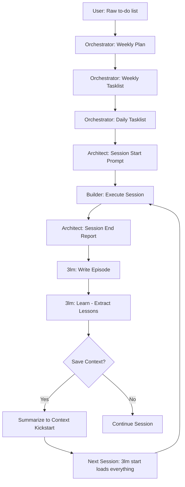

# 🔄 Effective Pipeline — AI-Suplex Session Lifecycle

## Overview
The Effective Pipeline defines how AI-Suplex sessions execute from start to finish. It is the operational core that makes the system work. Every AI agent operating AI-Suplex must understand this pipeline.

**Full workflow:** Cycle Plan → Weekly Plan → Daily Tasklist → Session Start → Execute & Capture → Session End + Report. Ref: `AI-Suplex Kick-start/The AI-Suplex Workflow Pipeline.md`

**Save Context:** Use `Prompt Patterns/📄 Pattern - Save Context.md` when switching tasks or focus areas within a session.

---

## 🎯 Key Principle: Daily Tasklists Are the Execution Unit

> **A Weekly Tasklist is a plan. A Daily Tasklist is a session.**

| Concept | Definition | Why It Matters |
|---------|------------|----------------|
| **Weekly Tasklist** | The strategic plan for the week (75+ tasks) | Too large for a single chat window |
| **Daily Tasklist** | The execution unit for one day (15-20 tasks) | Fits within model context window |
| **Session** | End-to-end execution of ONE daily tasklist | Enables proper session end + 3lm cycle |
| **Phase** | Sub-block within a session (e.g., "Morning Block") | Time-boxed work unit within a session |

---

## 🔄 The Complete Pipeline



---

## 📋 Step-by-Step Protocol

### Step 1: Planning (Orchestrator)

1. User provides raw to-do list
2. Orchestrator generates **Weekly Tasklist** (full week, all days)
3. Orchestrator generates **Daily Tasklist** for each day
4. Daily tasklist is saved to `Tasklists/Active/`

**Key Rule:** Daily tasklists are derived from the weekly plan. Each day = one tasklist = one session.

### Step 2: Session Start (Architect)

1. User says "AI-Suplex: Session Start"
2. Architect generates **Session Start Prompt** from daily tasklist
3. User copies prompt into Session Start macro
4. Session file created in `Sessions/Active/Start/`

**Key Rule:** Session start references the daily tasklist, not the weekly tasklist.

### Step 3: Execution (Builder)

1. Builder executes phases from daily tasklist
2. Each phase = time-boxed work block (e.g., 08:00-11:00)
3. Builder captures artifacts, insights, B-Bombs
4. Builder marks tasks as complete

**Key Rule:** All work happens within the daily tasklist scope. No scope creep.

### Step 4: Session End (Architect)

1. User says "AI-Suplex: Session End"
2. Architect generates **Session End Report** from completed tasks
3. Session file moved to `Sessions/Active/End/`
4. Report includes: what was done, metrics, lessons, next steps

**Key Rule:** Session end report is the input for 3lm end.

### Step 5: Memory Capture (3lm)

1. Run `node Tools/3lm.js end` — writes episode to `Memory/episodic/`
2. Run `node Tools/3lm.js learn` — extracts lessons to `Memory/lessons.md`
3. Run `node Tools/3lm.js promote --min 70` — promotes stable patterns
4. Run `node Tools/3lm.js index` — refreshes memory index

**Key Rule:** 3lm runs at the END of each daily session. Not weekly. Not monthly. Daily.

### Step 6: Save Context Protocol

When switching between chat windows or sessions:

1. **Summarize current context** — what was accomplished, what's pending
2. **Save summary to Context Kick-start**:
   - **Active:** `AI-Suplex Kick-start/Context Kick-start/Active/`
   - **Filename format:** `YYYY-MM-DD-cycle-x-week-y-mission-title.md`
   - **Archive previous:** Move old Active context to `Archived/`
3. **Start new session with 3lm** — `node Tools/3lm.js start` loads all accumulated memory

**Key Rule:** Never lose context between sessions. Always summarize before switching.

**Context Summary Template:**
```yaml
---
title: "Context Kickstart — Cycle X Week Y"
date: YYYY-MM-DD
cycle: X
week: Y
mission: "Mission Title"
status: active
---

## What Was Accomplished
- [list completed tasks]

## Current State
- [progress metrics]

## What the AI Needs to Know Next Session
- [key context for next session]

## Quick Links
- [relevant file paths]
```

---

## 🧠 Why Daily Tasklists Are Optimal

### 1. Context Window Management
- AI models have limited context windows (4K-1M tokens)
- A weekly tasklist (75+ tasks) exceeds practical limits
- A daily tasklist (15-20 tasks) fits comfortably
- Full context = better decisions = better execution

### 2. Self-Improving Loop (3lm)
- 3lm needs episodes to learn from
- Daily sessions produce daily episodes
- More episodes = faster learning = smarter next session
- Weekly episodes are too coarse — lessons get lost

### 3. Session End Reports
- A session end report covers ONE day's work
- Clear scope = clear metrics = clear lessons
- Weekly reports are too broad — hard to identify what worked

### 4. Context Continuity
- Daily summaries are small enough to carry forward
- Weekly summaries are too large — context gets truncated
- Daily rhythm = compound learning = north star achieved

---

## 📂 File Structure

```
Tasklists/Active/
├── 2026-06-21-launch-week-tasklist.md      ← Weekly plan
├── 2026-06-21-prelaunch-execution-tasklist.md  ← Daily (Sat)
├── 2026-06-22-ibm-wqr-tasklist.md          ← Daily (Sun)
└── ...

Sessions/Active/Start/
├── 2026-06-21-launch-week-session.md       ← Weekly session
├── 2026-06-21-prelaunch-execution.md       ← Daily session (Sat)
└── ...

Memory/episodic/Cycle-1/Week-1/
├── 2026-06-21-prelaunch.md                 ← Episode (Sat)
├── 2026-06-22-ibm-wqr.md                   ← Episode (Sun)
└── ...

AI-Suplex Kick-start/Context Kick-start/Active/
├── Profile.md                              ← User profile
├── Session Summary.md                      ← Latest session summary
└── ...
```

---

## ⚡ Quick Reference

| Action | Command | When |
|--------|---------|------|
| Start session | `3lm start` | Beginning of daily session |
| End session | `3lm end` | End of daily session |
| Extract lessons | `3lm learn` | After 3lm end |
| Promote patterns | `3lm promote --min 70` | Weekly (Saturday) |
| Check contradictions | `3lm revise` | After promotion |
| Refresh index | `3lm index` | After any memory change |

---

## 🎯 North Star

> **"Each new session starts smarter than the last."**

This is achieved by:
1. Daily 3lm cycles (not weekly)
2. Episodic memory accumulation
3. Lesson extraction after each session
4. Promotion of stable patterns to semantic/procedural
5. Save Context protocol (summarize + save)

---

*Procedural memory captured via AI-Suplex on 2026-06-22*
