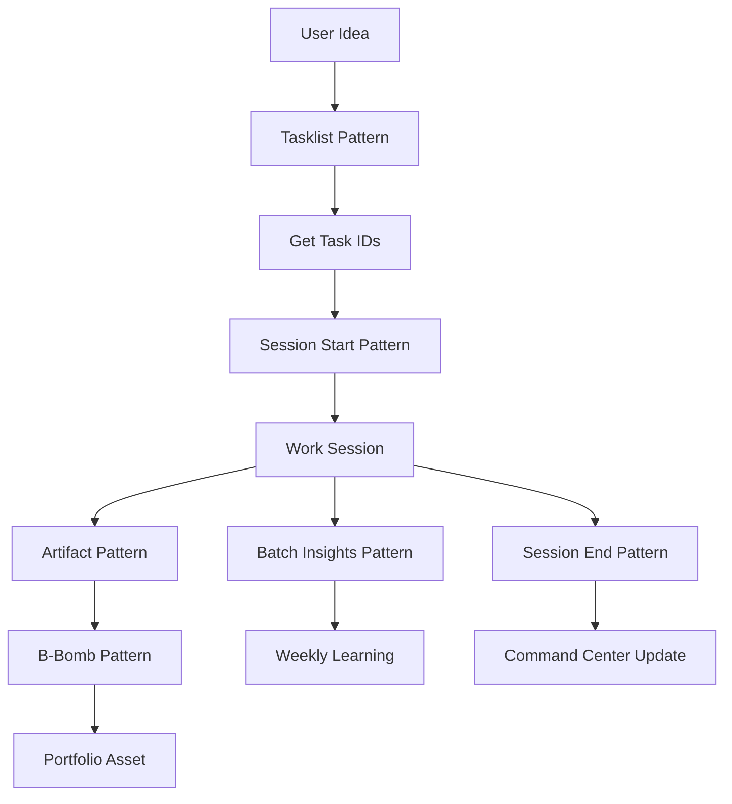

# 📖 AI-Suplex Prompt Pattern Quick Reference

**TWABAM ⚡!** This is your quick-start guide to using AI-Suplex Prompt Patterns—the fastest way to generate perfect outputs without learning the full system.

## 🚀 How Patterns Work (30-Second Explanation)

1. **Copy** a pattern file from this folder
2. **Paste** into any AI chat (Claude, ChatGPT, DeepSeek, etc.)
3. **Replace** the `Source` section with your content
4. **Execute** – AI generates professional, formatted output

That's it! No macros to learn, no folders to navigate.

## 📁 Available Patterns

| Pattern                  | Use When                                         | File                                              |
| ------------------------ | ------------------------------------------------ | ------------------------------------------------- |
| **Tasklist Generation**  | Converting raw to-do lists into structured plans | `📄 Pattern - Tasklist Generation.md`             |
| **Session Start Prompt** | Beginning a focused work session                 | `📄 Pattern - Session Start Prompt Generation.md` |
| **Session End Prompt**   | Generating session completion prompts            | `📄 Pattern - Session End Prompt Generation.md`   |
| **Session End Report**   | Creating comprehensive session reports           | `📄 Pattern - Session End Report.md`              |
| **Artifact Capture**     | Saving work-in-progress as structured artifacts  | `📄 Pattern - Artifact Capture.md`                |
| **B-Bomb Promotion**     | Polishing work for productization                | `📄 Pattern - B-Bomb Promotion.md`                |
| **Batch Insights**       | Capturing multiple learnings                     | `📄 Pattern - Batch Insight Generation.md`        |

## 🎯 Your First 5 Minutes with Patterns

### Step 1: Start with Tasklist
```yaml
1. Copy "📄 Pattern - Tasklist Generation.md"
2. Paste into Claude with: "I need to create a client onboarding system"
3. Get structured tasklist with roles & durations
4. Copy a Task ID (e.g., T001-H)
```

### Step 2: Generate Session Prompt
```yaml
1. Copy "📄 Pattern - Session Start Prompt Generation.md"
2. Replace Source with: "Task ID: T001-H"
3. Paste into AI chat
4. Get ready-to-use session start prompt
```

### Step 3: Execute & Capture
```yaml
1. Work on the task
2. Use "📄 Pattern - Artifact Generation.md" to save work
3. Use "📄 Pattern - Batch Insight Generation.md" for learnings
4. End with "📄 Pattern - Session End Report.md"
```

## 🧩 Pattern Structure Explained

Every pattern follows this format:
```yaml
<prompt-pattern>
CONTEXT: [What this pattern does]
- External Source 1: [Reference to AI skill]
- External Source 2: [Optional documentation]

EXAMPLE: [Example file to mimic]

TASK: [Instructions for the AI]

CORTEXMEM: [Auto-save memory instructions for the AI]

ADDITIONAL INSTRUCTIONS: [Optional post-generation steps]

CONTENT:
<content>
Source:
- Raw Content: [YOUR CONTENT GOES HERE]
</content>
</prompt-pattern>
```

**You only need to change:** The `Raw Content` section inside `<content>`.

## 🧠 CortexMem Integration

> **Note:** CORTEXMEM is embedded directly inside each `<prompt-pattern>` block. The AI handles memory saving automatically — no extra steps required.

Patterns integrate with **CortexMem** — a persistent memory layer that stores decisions, insights, discoveries, and state across sessions.

### Two Ways to Use

|           | MCP Agents (Cursor, Claude Code)                                          | Non-MCP Agents (ChatGPT, DeepSeek)                         |
| --------- | ------------------------------------------------------------------------- | ---------------------------------------------------------- |
| **How**   | AI calls `get_context`, `save_context`, `summarize_session` automatically | Run the `./cm` CLI helper from `AI-Suplex-777/cm` manually |
| **Setup** | MCP config already in `~/.cursor/mcp.json` and `.claude.json`             | No setup needed — script is ready to use                   |

### CLI Helper Usage

```bash
node cm get_context                              # Pyramid overview of all stored context
node cm get_context --query "database" --depth 3 # Search for specific context
node cm save_context --context_type decision --content "Chose PostgreSQL for ACID"
node cm summarize_session --session_summary "Completed T003-H testing"
node cm get_status                               # Show store stats
```

### Context Types

| Type         | When to Use                                         |
| ------------ | --------------------------------------------------- |
| `decision`   | Architectural choices, next actions, tasklist plans |
| `discovery`  | Insights, B-Bombs, non-obvious learnings            |
| `state`      | WIP artifacts, current progress                     |
| `constraint` | Hard rules, blockers, boundaries                    |
| `preference` | Conventions, style choices, patterns                |

Each pattern's CORTEXMEM section (embedded inside the `<prompt-pattern>` block) specifies exactly which context type to use and when. The AI executes it automatically.

## 🔗 Integration with Full AI-Suplex

Patterns connect to the complete system:
- **Tasklists** → Feed into session prompts
- **Artifacts** → Can be promoted to B-Bombs
- **Session Reports** → Update Command Center dashboard
- **Insights** → Feed into weekly reviews

## 💡 Pro Tips

1. **Start simple** – Use Tasklist pattern first, then expand
2. **Save outputs** – Follow ADDITIONAL INSTRUCTIONS to save files in correct folders
3. **Chain patterns** – Tasklist → Session Prompt → Artifact → B-Bomb
4. **No Obsidian?** – Patterns work in any AI chat, even without Obsidian installed
5. **Stuck?** – Check the example file referenced in each pattern

## 📊 Pattern Workflow



## ❓ Common Questions

**Q: Do I need Obsidian installed to use patterns?**  
A: No! Patterns work in any AI chat. Copy-paste them directly.

**Q: What if the AI doesn't know about AI-Suplex?**  
A: Patterns include all necessary context. The AI learns from the pattern itself.

**Q: Where do I save the generated files?**  
A: Each pattern includes ADDITIONAL INSTRUCTIONS with save locations, or you can save anywhere.

**Q: Can I modify prompt patterns?**  
A: Yes! Copy the pattern, customize it for your needs, and save your own version.

## 🎯 Next Steps

1. **Try it now** – Copy any pattern and paste into your favorite AI
2. **Bookmark this folder** – `AI-Suplex-777/Prompt Patterns/`
3. **Visit Command Center** – For live dashboard and pattern quick access
4. **Check README** – For full installation and advanced features

**TWABAM ⚡!** You're now ready to use AI-Suplex at maximum speed. Patterns eliminate the learning curve and deliver professional results immediately.