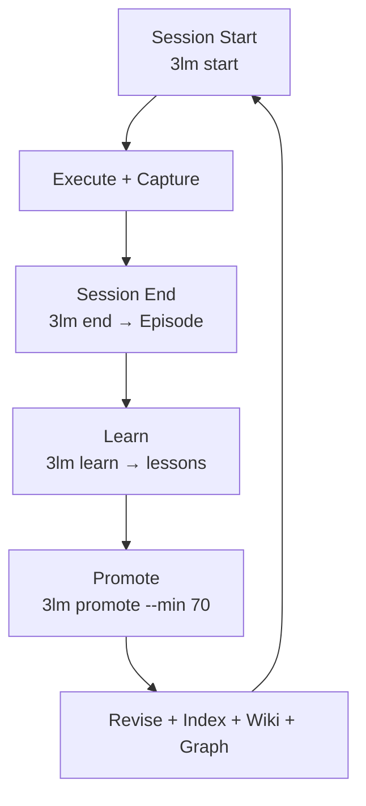

# AI-Suplex 7-7-7

**Bring your own agent. Keep your memory.**

AI-Suplex is a file-first, markdown-first **self-improving execution framework** — a shared memory layer that any AI agent (Hermes, Claude Code, Zed, Codex, any agent with file + bash access) can read and write. Each session files what happened, extracts lessons, and promotes the durable ones, so **each new session starts smarter than the last.**

## Resources

- 📥 **Free:** the full framework source is [this repo](https://github.com/kmagwenzi/ai-suplex) — clone it and run the quick start below.
- 📦 **Configured 7-7-7 vault** (paid): [selar.com/270lq55ke0](https://selar.com/270lq55ke0)
- ▶️ **Deep Ultra persona — short:** [youtu.be/QLQVJ-5g8IU](https://youtu.be/QLQVJ-5g8IU)
- ▶️ **Walkthrough:** [youtu.be/R0vLuNf9VUs](https://youtu.be/R0vLuNf9VUs)
- 🦸 **Ultra Edition preview:** [ai-suplex-ultra-preview.netlify.app](https://ai-suplex-ultra-preview.netlify.app/)

## The loop


```mermaid
flowchart TD
    A[Session Start<br/>3lm start] --> B[Execute + Capture]
    B --> C[Session End<br/>3lm end → Episode]
    C --> D[Learn<br/>3lm learn → lessons]
    D --> E[Promote<br/>3lm promote --min 70]
    E --> F[Revise + Index + Wiki + Graph]
    F --> A
```

## The data model

| Memory type | Question it answers | Formed by |
|-------------|--------------------|-----------|
| **Episodic** | What happened? | `3lm end` |
| **Lessons** | What did I learn? | `3lm learn` |
| **Semantic** | What's true / preferred? | `3lm promote` |
| **Procedural** | How do I do X? | `3lm promote` |

The **knowledge graph** (SQLite, zero-dependency) indexes every file into entities + typed relationships (`relates_to`, `supersedes`, `references`, `implements`, `contains`), so you can query *"what relates to X?"* instead of grep keywords.

## The three tools

| Tool | What it does |
|------|--------------|
| `3lm` | Memory CLI: start, end, learn, add-lessons, promote, revise, index, status, sync |
| `vault-index` | Scans the vault → builds the file index (`wiki-index.md` / `wiki-full.md`) |
| `knowledge-graph` | Builds + queries the SQLite graph from the index |

## Quick start (60 seconds)

```bash
git clone https://github.com/kmagwenzi/ai-suplex.git
cd ai-suplex/AI-Suplex-777
node Tools/initialise-vault.js                  # create period.md + your vault skeleton
node Tools/vault-index.js --current             # current-window index + session brief
node Tools/knowledge-graph.js --build-current   # build the current graph
node Tools/3lm.js start --context               # load your memory + context
```

Requires **Node 22+** (`node:sqlite`). **Python 3** for `Tools/session_context.py` (generated session
context) and `Tools/bbomb_hunter.py` (ranked B-Bomb candidates). **Obsidian is optional** — the
`Scripts/` macros are Obsidian QuickAdd macros; everything under `Tools/` runs headless.

## Structure

```
AI-Suplex-777/
├── AGENTS.md              ← how any agent operates this vault
├── Skills/                ← 12 AI skills
├── Prompt Patterns/       ← copy-paste patterns
├── Scripts/               ← 24 QuickAdd macros (Sweeper + core)
├── Templates/             ← session templates
├── Tools/                 ← 3lm · vault-index · knowledge-graph · session context · B-Bomb hunter
├── Memory/                ← episodic · semantic · procedural · lessons
├── Guides/                ← workflow guides
└── AI-Suplex Kick-start/  ← methodology + the Deep Ultra persona
```

## Open-core

The **library** (this repo) is free and open source. The **harness** — the scheduled, gated, self-driving layer that runs it — is **AI-Suplex Ultra** (code name: Deep Ultra 🦸). [Preview the Ultra Edition](https://ai-suplex-ultra-preview.netlify.app/).

## License

MIT

## Author

Kudakwashe Magwenzi · [linkedin.com/in/kudakwashe-magwenzi](https://linkedin.com/in/kudakwashe-magwenzi) · [github.com/kmagwenzi](https://github.com/kmagwenzi)

---

## 👤 Built by

**Kudakwashe Magwenzi** — AI agent developer in Harare. I build production AI systems for African businesses and open-source the chassis.

- More work: [github.com/kmagwenzi](https://github.com/kmagwenzi)
- LinkedIn: [linkedin.com/in/kudakwashe-magwenzi](https://linkedin.com/in/kudakwashe-magwenzi)
- Live product: [wqr.co.zw](https://wqr.co.zw)
