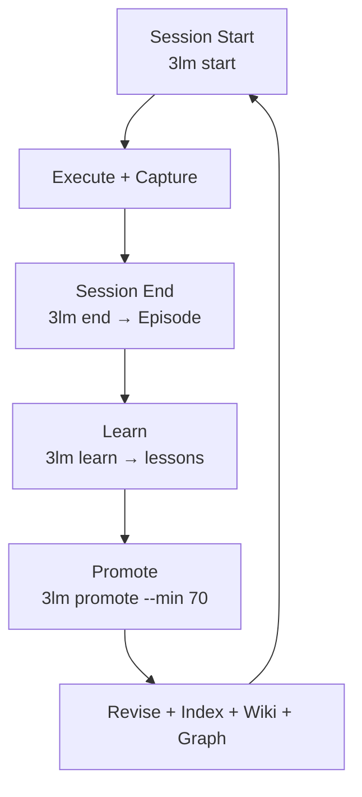

<p align="center">
  
</p>

<h1 align="center">AI-Suplex 7-7-7</h1>

<p align="center">
  <strong>A file-first, self-improving execution framework for AI agents.</strong><br/>
  Built, shipped, and run in production by <a href="https://linkedin.com/in/kudakwashe-magwenzi">Kudakwashe Magwenzi</a> — an AI engineer in Harare, Zimbabwe.
</p>

<p align="center">
  <a href="https://github.com/kmagwenzi/ai-suplex/actions/workflows/ci.yml"></a>
  <a href="LICENSE"></a>
</p>

> **Bring your own agent. Keep your memory.** Every agent forgets the moment the chat closes. AI-Suplex gives it a real memory — each session files what happened, extracts lessons, and promotes only what earns its place. **Each new session starts smarter than the last.**

---

## 👀 Proof it works (not a demo)

This is the discipline behind live, production systems:

| Proof | What it is |
|---|---|
| 🛒 **[wqr.co.zw](https://wqr.co.zw)** | A WhatsApp commerce agent serving Zimbabwean SMEs — real orders, real Paynow/EcoCash payments |
| 🦸 **[Ultra preview](https://ai-suplex-ultra-preview.netlify.app/)** | The gated, self-driving layer (code name: Deep Ultra) |
| 📦 **[dsh-ai-suplex](https://www.npmjs.com/package/dsh-ai-suplex)** | This same loop, shipped as an open-source DeepSeek Harness plugin |
| 🧠 **[The framework](AI-Suplex-777)** | Skills · Prompt Patterns · Tools · 3-layer memory — MIT, open source |

## 🎥 Watch (90 seconds)

- ▶️ **Walkthrough** → [youtu.be/R0vLuNf9VUs](https://youtu.be/R0vLuNf9VUs)
- 🦸 **Meet the Deep Ultra persona** → [youtu.be/QLQVJ-5g8IU](https://youtu.be/QLQVJ-5g8IU)

## 👋 How to use this

**I'm a business owner.** I build production AI systems for African businesses — WhatsApp commerce, payment integrations, RAG, agent orchestration. [wqr.co.zw](https://wqr.co.zw) is the reference build.
→ **Work with me:** [kuda@ai-suplex.co.zw](mailto:kuda@ai-suplex.co.zw) · [LinkedIn](https://linkedin.com/in/kudakwashe-magwenzi)

**I'm a recruiter or engineer.** This repo is the proof of depth — a memory layer with a human approval gate, a zero-dependency SQLite knowledge graph, and a CLI that runs the whole loop.
→ **The résumé behind it:** [github.com/kmagwenzi](https://github.com/kmagwenzi) · [LinkedIn](https://linkedin.com/in/kudakwashe-magwenzi)

---

## The loop


```mermaid
flowchart TD
    A[Session Start<br/>3lm start] --> B[Execute + Capture]
    B --> C[Session End<br/>3lm end → Episode]
    C --> D[Learn<br/>3lm learn → lessons]
    D --> E[Promote<br/>3lm promote --min 70]
    E --> F[Revise + Index + Wiki + Graph]
    F --> A
```

## The data model

| Memory type | Question it answers | Formed by |
|-------------|--------------------|-----------|
| **Episodic** | What happened? | `3lm end` |
| **Lessons** | What did I learn? | `3lm learn` |
| **Semantic** | What's true / preferred? | `3lm promote` |
| **Procedural** | How do I do X? | `3lm promote` |

The **knowledge graph** (SQLite, zero-dependency) indexes every file into entities + typed relationships (`relates_to`, `supersedes`, `references`, `implements`, `contains`), so you can query *what relates to X?* instead of grep keywords.

## The three tools

| Tool | What it does |
|------|--------------|
| `3lm` | Memory CLI: start, end, learn, add-lessons, promote, revise, index, status, sync |
| `vault-index` | Scans the vault → builds the file index |
| `knowledge-graph` | Builds + queries the SQLite graph from the index |

## Quick start (60 seconds)

```bash
git clone https://github.com/kmagwenzi/ai-suplex.git
cd ai-suplex/AI-Suplex-777
node Tools/initialise-vault.js
node Tools/vault-index.js --current
node Tools/knowledge-graph.js --build-current
node Tools/3lm.js start --context
```

Requires **Node 22+** (`node:sqlite`). **Python 3** for `Tools/session_context.py` and `Tools/bbomb_hunter.py`. **Obsidian is optional** — `Scripts/` macros are QuickAdd; everything under `Tools/` runs headless.

## Structure

```
AI-Suplex-777/
├── AGENTS.md              ← how any agent operates this vault
├── Skills/                ← 12 AI skills
├── Prompt Patterns/       ← copy-paste patterns
├── Scripts/               ← QuickAdd macros
├── Templates/             ← session templates
├── Tools/                 ← 3lm · vault-index · knowledge-graph
├── Memory/                ← episodic · semantic · procedural · lessons
├── Guides/                ← workflow guides
└── AI-Suplex Kick-start/  ← methodology + the Deep Ultra persona
```

## Open-core

The **library** (this repo) is free and open source. The **harness** — the scheduled, gated, self-driving layer — is **AI-Suplex Ultra** (code name: Deep Ultra 🦸). [Preview it](https://ai-suplex-ultra-preview.netlify.app/).

## License

MIT

## Author

**Kudakwashe Magwenzi** — AI agent developer in Harare. I build production AI systems for African businesses and open-source the chassis.

- 📧 [kuda@ai-suplex.co.zw](mailto:kuda@ai-suplex.co.zw)
- 🔗 [LinkedIn](https://linkedin.com/in/kudakwashe-magwenzi)
- 🐙 [GitHub](https://github.com/kmagwenzi)
- 🛒 [Live product — wqr.co.zw](https://wqr.co.zw)
